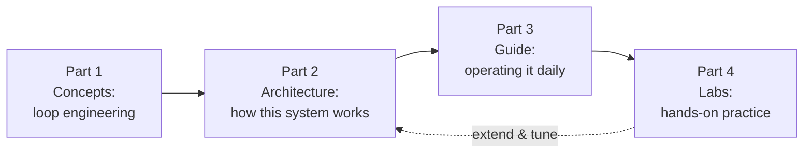

# The Agent Studio Book

*Everything here teaches one system: a team of AI agents that builds software while
you keep exactly two powers — approving specs and merging code.*

## How to read this

Read Part 1 once, in order — it's the theory the whole system is built on, and it's
short. Part 2 is reference-shaped: read 01 and 05 now, the rest when you touch that
subsystem. Part 3 is what you'll have open while operating. The labs are where it
becomes muscle memory: do Lab 1 end to end before trusting anything to the loop.

If you only have twenty minutes: [concepts/01](concepts/01-from-prompts-to-loops.md),
[architecture/01](architecture/01-system-overview.md), then run `make demo`.

## Part 1 — Concepts: loop engineering

The discipline this system practices: designing systems that prompt agents, verify
their output, and iterate — instead of prompting them yourself.

1. [From prompts to loops](concepts/01-from-prompts-to-loops.md) — the leverage
   shift, the six components every loop system has, and the autonomy slider.
2. [Anatomy of a harness](concepts/02-anatomy-of-a-harness.md) — model vs harness,
   and the three enforcement layers (intent, harness, environment).
3. [The Ralph loop](concepts/03-the-ralph-loop.md) — fresh context + durable files:
   the technique behind the coder, from Huntley's while-loop to `/goal`.
4. [Verification is the bottleneck](concepts/04-verification-is-the-bottleneck.md) —
   why makers never check their own work, and what "harness-owned completion" means.
5. [Autonomy and safety](concepts/05-autonomy-and-safety.md) — earned autonomy, stop
   rules, budgets, and the three things loops never take off your plate.

## Part 2 — Architecture: how this system is built

1. [System overview](architecture/01-system-overview.md) — the full map and one
   item's journey through it.
2. [The state machine](architecture/02-state-machine.md) — states, actors, and why
   the human gates are code, not prompts.
3. [Trackers and work items](architecture/03-trackers-and-work-items.md) — the work
   queue abstraction: markdown files or GitHub Issues.
4. [Agents, skills, runtimes](architecture/04-agents-skills-runtimes.md) — the agent
   bundle and how knowledge reaches each model.
5. [GoalLoop internals](architecture/05-goal-loop-internals.md) — the deep dive:
   one iteration, mechanism by mechanism.
6. [Orchestrator and safety](architecture/06-orchestrator-and-safety.md) — ticks,
   claims, review rounds, and the enforcement stack.

## Part 3 — Guide: operating it

1. [Install and first run](guide/01-install-and-first-run.md) — from clone to a
   green demo, with the demo output explained line by line.
2. [Daily workflow](guide/02-daily-workflow.md) — your day as the human in the loop.
3. [Configuration](guide/03-configuration.md) — every `studio.yaml` key and when to
   change it.
4. [Going live on GitHub](guide/04-going-live-on-github.md) — labels, tokens, and
   the first real work item.
5. [Troubleshooting](guide/05-troubleshooting.md) — reading `runs/` and `.loop/`,
   and what thrash, escalation, and degraded review mean.

## Part 4 — Labs

1. [Build an app from zero](labs/01-build-an-app.md) — the full pipeline, twice
   gated by you.
2. [Add a feature](labs/02-add-a-feature.md) — brownfield work and the revision loop.
3. [Fix a bug](labs/03-fix-a-bug.md) — the short pipeline: bugs skip the PRD.
4. [Watch the loop save itself](labs/04-watch-the-loop-save-itself.md) — sabotage a
   gate and watch feedback injection, guardrails, and the circuit breaker fire.
5. [Teach the team](labs/05-teach-the-team.md) — memory, house rules, and writing a
   new skill.
6. [Extend the studio](labs/06-extend-the-studio.md) — add a third reviewer and stub
   a new tracker against the interface.

## Source material

This book distills [spec.md](../spec.md) (the system's contract), the
[agentic engineering field guide](../agentic-engineering-field-guide.md), and two
research reports: [loop engineering](../research/loop-engineering-research.md) and
[Claude Code skills](../research/claude-code-skills-research.md). When the book and
the code disagree, the code wins — and please fix the book.
