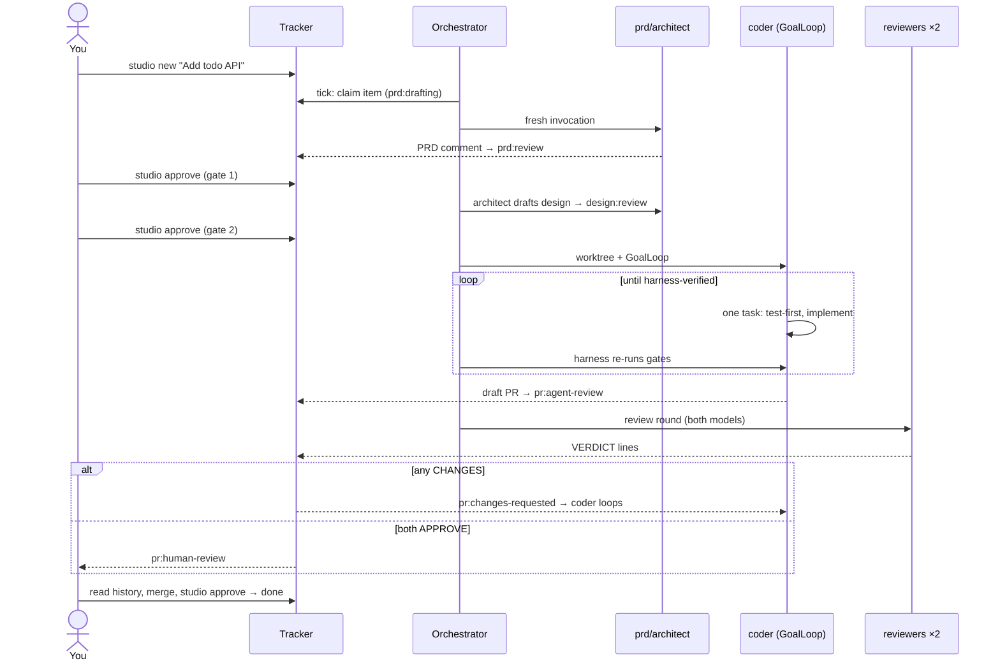

# System overview

*The full map: four swappable abstractions, one plain-code orchestrator, one goal
loop — and one work item's complete journey through them.*

## The pieces

| Piece | Module | Job |
|---|---|---|
| **Tracker** | `studio/tracker/` | the work queue and state store, *outside* the agents — markdown files or GitHub Issues, same interface |
| **State machine** | `studio/state.py` | which transitions exist and **who** may take them; the human gates live here as code |
| **ModelRuntime** | `studio/runtime/` | how a prompt reaches a model CLI: `claude -p`, `codex exec`, or a scripted fake |
| **Agents** | `config/studio.yaml` + `prompts/` + `.claude/skills/` | declarative bundles: prompt + skills + memory + runtime |
| **AgentRegistry** | `studio/agents/registry.py` | turns bundles into runnable invocations and native subagent files |
| **GoalLoop** | `studio/loop.py` | the coder's Ralph loop with harness-owned completion |
| **Orchestrator** | `studio/orchestrator.py` | plain code, no LLM: poll → claim → dispatch → transition → persist |
| **CLI** | `studio/cli.py` | your console: `init` / `new` / `approve` / `run` / `status` / `demo` |

Two cross-cutting choices shape everything:

- **One subprocess seam.** Every external process — `git`, `gh`, `claude`, `codex`,
  every gate command — goes through `studio/execution.py:CommandExecutor`. Tests
  inject a fake and assert on exact argv; nothing in the test suite touches the
  network or needs an API key.
- **No LLM framework.** The orchestrator and loop are a few hundred lines of typed
  Python. When it misbehaves at 2am, you read the code, not a framework's issue
  tracker.

## One item's journey, in files

The sequence diagram above, seen from the filesystem (paths for a markdown-tracker
setup; the demo prints all of this live):

1. `studio new` → `.work/items/1.md` appears (frontmatter: state, kind, claim) and
   `.work/board.md` re-renders.
2. Each dispatch → `runs/<stamp>-1-<agent>/{prompt.md,output.md}` — the full,
   greppable record of what every agent saw and said.
3. The coder's worktree → `../.studio-worktrees/1` on branch `agent/1-add-todo-api`,
   with `.loop/{plan.json,progress.md,guardrails.md}` as the loop's memory.
4. Agent comments accumulate *on the item* — the PRD, the design, the gate reports,
   both reviews. The item file ends up reading like a project thread.
5. `.agent-logs/orchestrator.log` gets one line per tick; `audit.jsonl` one per tool
   call when running under Claude Code hooks.

## Where behavior comes from

When you want to change how the system acts, there are exactly four places to look,
in escalating order of force (see
[anatomy of a harness](../concepts/02-anatomy-of-a-harness.md) for why the order
matters):

1. **Prompts and skills** (`prompts/`, `.claude/skills/`) — what agents are told.
2. **Config** (`config/studio.yaml`) — who runs on what model, loop budgets,
   approvals required, concurrency ([configuration reference](../guide/03-configuration.md)).
3. **The state machine** (`studio/state.py`) — what transitions are possible at all.
4. **Hooks and permissions** (`.claude/`) — what tool calls can physically dispatch.

## Reading order for the rest of Part 2

[The state machine](02-state-machine.md) explains the spine everything hangs off.
[Trackers](03-trackers-and-work-items.md) and
[agents/skills/runtimes](04-agents-skills-runtimes.md) cover the two swappable edges.
[GoalLoop internals](05-goal-loop-internals.md) is the deep end — the mechanism that
makes the coder trustworthy. [Orchestrator and safety](06-orchestrator-and-safety.md)
ties the pieces together and closes with the enforcement stack.

---

[← Part 1: Autonomy and safety](../concepts/05-autonomy-and-safety.md) ·
[Index](../README.md) · [The state machine →](02-state-machine.md)
