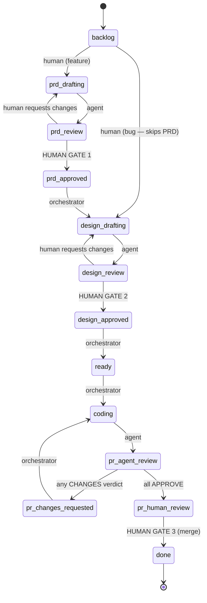

# The state machine

*Fourteen states, three actor classes, and two human gates that agents cannot take —
enforced by code that raises, not prose that suggests.*



(Every state can also escalate to `needs-human`, and only a human routes items back
out of it — omitted above for legibility.)

## Transitions are data; actors are enforced

`studio/state.py` holds the whole machine as a dict — edge → allowed actor classes:

```python
TRANSITIONS: dict[tuple[str, str], frozenset[Actor]] = {
    ("prd:review", "prd:approved"): _H,       # HUMAN GATE: spec approval
    ("prd:drafting", "prd:review"): _A,       # agents advance their own drafts
    ("pr:agent-review", "pr:human-review"): _O,  # fired only on unanimous APPROVE
    ...
}
```

Three actor classes: `HUMAN` (you, via `studio approve` or direct tracker edits),
`AGENT` (transitions that carry an agent's work product), `ORCHESTRATOR` (mechanical
consequences: claiming ready items, acting on verdicts). Every tracker validates
through one function before moving anything:

```python
check_transition(from_state, to_state, actor, kind)   # raises, or you may proceed
```

Two exception types tell you *what kind* of wrong: `IllegalTransition` (no such
edge, or a feature trying to skip the PRD) and `NotAllowedForActor` (the edge
exists; you don't get to take it). The tests treat the human gates as the crown
jewels — `tests/test_state.py::test_human_only_transitions_reject_agent_actor`
proves an `AGENT` or `ORCHESTRATOR` actor is refused at all three gates, and the
main `verify.sh` has a dedicated check (#8) that those tests exist and pass.

## Why states, not conversations

The tracker-plus-states design is what makes this a *system* rather than a chat:

- **The queue is the shared memory.** Agents coordinate by reading and writing work
  items, never by talking to each other — so any agent can crash, restart, or be
  swapped for a different model without anyone else noticing. (This is Osmani's
  "memory on disk" component; see
  [concepts/01](../concepts/01-from-prompts-to-loops.md).)
- **States make the human's job legible.** `studio status` doesn't summarize vibes;
  it lists exactly the four states that need you: `prd:review`, `design:review`,
  `pr:human-review`, `needs-human`.
- **States make automation safe.** The orchestrator dispatches on state alone. A
  human-gated state has no registered agent, so there is nothing to dispatch — being
  skipped isn't a policy, it's a structural absence.

## Kinds and the short path

Work items carry a `kind` (`feature | bug | chore`). One edge is kind-guarded:
`backlog → design:drafting` is legal **only for bugs** — a bug report plus a
half-page fix design is enough process, and demanding a PRD for every null-pointer
fix is how pipelines get bypassed. Features must take the long road; the guard
raises `IllegalTransition` if they try the shortcut. Lab 3
([fix a bug](../labs/03-fix-a-bug.md)) walks the short path end to end.

## Escalation: the universal exit

Any actor may move any live item to `needs-human` — it's the one edge open to
everyone, because a blocked agent that *can't* escalate will guess instead, and
guesses are expensive. Leaving `needs-human` is human-only, to any state you choose:
re-route to `coding` after fixing a credential, back to `design:drafting` if the
design was the problem, or straight to `done` if the item is moot. The GoalLoop's
non-verified exits land here automatically, with a progress report attached
([GoalLoop internals](05-goal-loop-internals.md), §stop rules).

## Where the states physically live

The machine is abstract; storage is the tracker's problem
([next chapter](03-trackers-and-work-items.md)): a `state:` field in markdown
frontmatter, or a `studio:<state>` label on a GitHub issue. Both validate through
the same `check_transition` — the rules cannot drift between backends because they
exist in exactly one place.

---

[← System overview](01-system-overview.md) · [Index](../README.md) ·
[Trackers and work items →](03-trackers-and-work-items.md)
