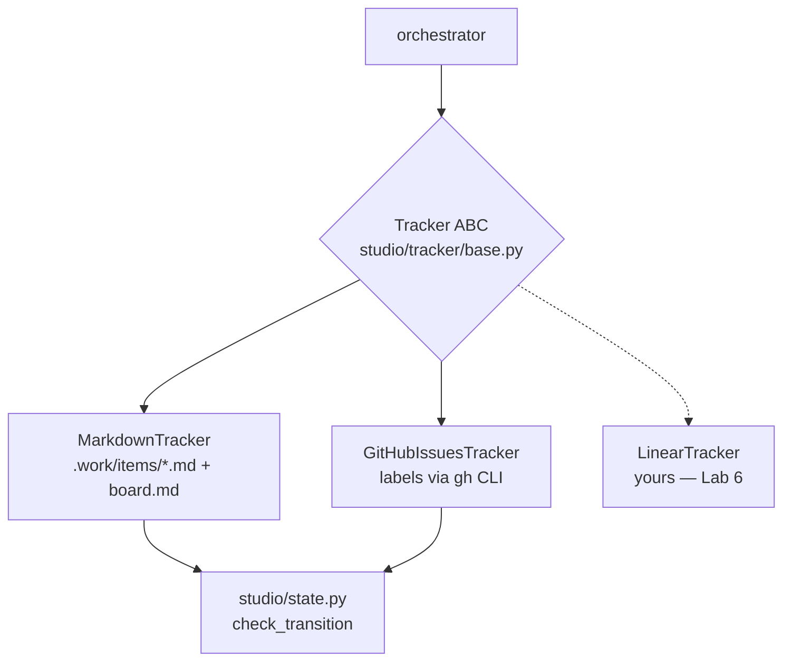

# Trackers and work items

*The work queue lives outside the agents. One interface, two backends: plain
markdown files for offline work and testing, GitHub Issues for real projects.*



## The interface

`studio/tracker/base.py` defines the whole contract — small on purpose:

```python
class Tracker(ABC):
    def create(self, title, body, state, kind="feature") -> WorkItem: ...
    def get(self, item_id) -> WorkItem: ...
    def list(self, state=None, kind=None) -> list[WorkItem]: ...
    def comment(self, item_id, body, author) -> None: ...
    def comments(self, item_id) -> list[Comment]: ...
    def transition(self, item_id, to_state, actor) -> None: ...  # validates!
    def claim(self, item_id, agent_name) -> bool: ...            # single-flight
    def release(self, item_id, agent_name) -> None: ...
```

A `WorkItem` is deliberately plain: id, title, body, state, kind, `claimed_by`, url,
timestamps, comments. Two design rules bind every implementation:

- **`transition()` must validate.** Both backends call
  `check_transition(item.state, to_state, actor, kind)` before touching storage —
  the [state machine](02-state-machine.md) cannot be bypassed by picking a
  different backend.
- **`claim()` is the concurrency story.** One agent per item: claim before work,
  release after, and a second claimant gets `False`, not an exception.

## MarkdownTracker: the offline backend

`studio/tracker/markdown.py`. Each item is a human-readable file:

```markdown
---
title: Add todo API
state: prd:review
kind: feature
claimed_by: ''
created: '2026-07-07T07:20:11+00:00'
---

CRUD todos over HTTP

<!-- comment author="prd" -->
# PRD
R1: POST /todos creates a todo and returns its id.
```

Comments are appended as marked blocks, so `cat .work/items/1.md` reads like a
project thread. Every write is atomic (temp file + `os.replace`) and every write
re-renders `.work/board.md` — a kanban view grouped by state in pipeline order.
Claims use the filesystem's own atomicity: `O_CREAT | O_EXCL` on a lock file, so two
processes racing for the same item cannot both win. Re-claiming by the current
holder is idempotent; `release()` by anyone else is a no-op.

This backend is what `make demo` and the entire test suite run on: full lifecycle,
zero network. It's also genuinely usable solo — a `.work/` directory in your repo is
a perfectly good personal queue.

## GitHubIssuesTracker: the production backend

`studio/tracker/github.py`. The mapping:

| Concept | GitHub |
|---|---|
| work item | an issue |
| state | a `studio:<state>` label (exactly one per issue) |
| kind | a `kind:<feature\|bug\|chore>` label |
| claim | a `claimed-by:<agent>` label |
| comment authorship | a `**[author]**` prefix in the comment body (recovered on read) |
| transition | `gh issue edit --remove-label old --add-label new` |

Everything goes through the `gh` CLI via the injected `CommandExecutor` — never the
REST API directly. That buys three things: your existing `gh auth` is the only
credential setup, tests can fake the executor and assert on exact argv
(`tests/test_tracker_github.py`), and every operation is something you could have
typed yourself. `scripts/setup-github.sh` creates all the labels (with colors that
make your gates red and the agents' lanes blue) in one command.

Honest limitation, recorded in [DECISIONS.md](../../DECISIONS.md): the GitHub
`claim()` is read-then-write — label check, then label add — so two *separate
orchestrators* polling the same repo could race. The markdown claim is truly atomic;
the GitHub one assumes a single orchestrator, which is the v1 deployment shape.

## Choosing, and switching

`config/studio.yaml` picks the backend; nothing else changes:

```yaml
tracker: {kind: markdown, root: .work}          # offline / demo / solo
tracker: {kind: github, repo: you/your-app}     # real project
```

The factory (`studio/tracker/__init__.py:make_tracker`) is a two-branch function —
adding a backend means implementing the ABC, adding a branch, and mapping states to
whatever the backend calls them. [Lab 6](../labs/06-extend-the-studio.md) does
exactly this for Linear, test-first, and is the recommended template for ADO, Jira,
or anything else with labels and comments.

---

[← The state machine](02-state-machine.md) · [Index](../README.md) ·
[Agents, skills, runtimes →](04-agents-skills-runtimes.md)
