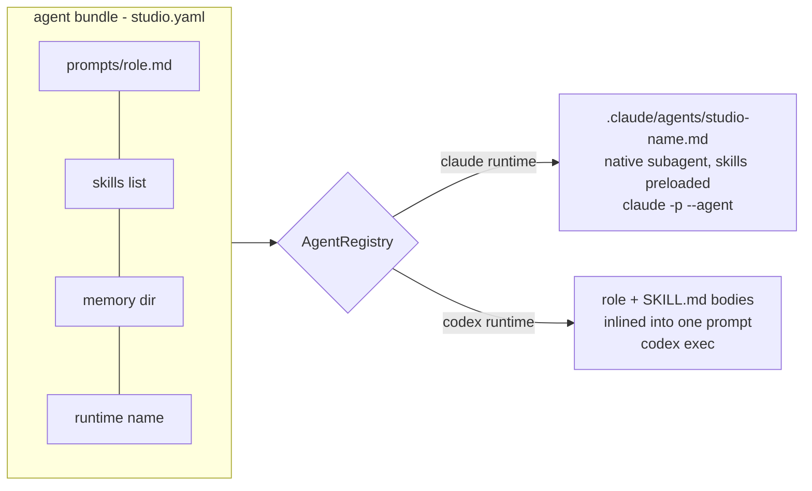

# Agents, skills, runtimes

*An agent is a declarative bundle — prompt + skills + memory + runtime. The registry
turns bundles into invocations, delivering knowledge natively where the runtime
supports it and inlining it where it doesn't.*



## The bundle

One entry in `config/studio.yaml` defines an agent completely:

```yaml
coder:
  runtime: claude
  prompt: prompts/coder.md
  skills: [tdd-workflow, run-and-verify]
  handles: ready                                # the state it picks work from
  loop: {max_iterations: 10, max_minutes: 90}   # present => runs inside a GoalLoop
  memory: coder                                 # journal dir (reviewers share one)
```

Five bundles ship: `prd`, `architect`, `coder`, and two reviewers — deliberately on
**different models** (`reviewer-a`: claude, `reviewer-b`: codex) so they don't share
blind spots ([why](../concepts/04-verification-is-the-bottleneck.md)). Config is
validated hard at load (`studio/config.py`): unknown state, missing prompt file, or
unknown skill fails with a message that names the field — a bad config never reaches
a running orchestrator.

## Prompts: the role contracts

Each `prompts/<role>.md` has the same five sections, and `verify.sh` greps that they
stay: **Role**, **Output contract** (exact document structure, or the
machine-parseable `VERDICT:` line for reviewers), **NEVER** (the anti-goals),
**Stop rule** (when to emit `NEEDS_HUMAN:` instead of guessing), **Memory** (read
the journal, append one lesson). The output contracts are what make the orchestrator
simple: it parses one comment from a drafter, one verdict line from a reviewer,
nothing fuzzier.

## Skills: knowledge as files

Skills follow the [agentskills.io](https://agentskills.io/specification) standard —
a directory whose `SKILL.md` carries YAML frontmatter (`name` matching the
directory, a tight, boring `description`) and a body that teaches one procedure.
Five ship in `.claude/skills/`: `spec-writing`, `acceptance-criteria`,
`tdd-workflow`, `run-and-verify`, `code-review-rubric`. They are the "intent stops
costing you over and over" component from
[concepts/01](../concepts/01-from-prompts-to-loops.md): conventions written once,
delivered to every relevant invocation, versioned in git like everything else.

## Delivery: native when possible, inline otherwise

The registry (`studio/agents/registry.py`) adapts skill delivery to the runtime:

- **Claude runtime.** `studio init` *generates* a native Claude Code subagent file
  per agent — `.claude/agents/studio-<name>.md` with `skills:` frontmatter (full
  preloading, per the [skills research](../../research/claude-code-skills-research.md))
  and the role prompt as its body. Invocation becomes
  `claude -p "<task context>" --agent studio-coder`: Claude Code itself handles the
  role prompt, skill preloading, permissions, and hooks; the studio sends only the
  task context (item, comments, journal tail, branch).
- **Codex or anything else.** No native subagent concept, so the registry composes
  one prompt: role prompt + a `## Skills` section with each SKILL.md body inlined +
  task context. Portable, same knowledge, more tokens.

Both paths are tested (`tests/test_registry.py`), including that the claude path
does *not* duplicate the role prompt in the task context and the codex path *does*
include it, in the right order.

## Runtimes: three, behind one interface

`studio/runtime/base.py` defines `run(prompt, *, cwd, timeout_s, agent) →
RuntimeResult` plus `available()`. Implementations:

| Runtime | Invocation | Notes |
|---|---|---|
| `ClaudeCodeRuntime` | `claude -p <prompt> --output-format text [--agent studio-X] <extra_flags>` | headless; `extra_flags` from config carries the permission mode |
| `CodexRuntime` | `codex exec <prompt> <extra_flags>` | `available()` false when the CLI is missing → [degraded review](06-orchestrator-and-safety.md) |
| `FakeRuntime` | scripted strings or callables | powers the demo and every test; records prompts/cwds/agents |

Runtime configs carry a `kind` (defaulting to their name) so you can define
`fast-reviewer: {cmd: claude, kind: claude, extra_flags: [--model, haiku]}` — the
factory maps kind → class, the name is yours.

## Memory: journals with a shape

Each role owns `memory/<role>/journal.md` (both reviewers share `reviewer/` via the
`memory:` key). The registry injects the last 50 lines into every task context; the
prompts require appending one durable lesson after each work product. It's the
simplest memory that compounds: project truths and human preferences accumulate,
task minutiae don't. [Lab 5](../labs/05-teach-the-team.md) exercises the whole
learning loop, including promoting a recurring lesson into [AGENTS.md](../../AGENTS.md).

## Extending

New agent = a prompt file + a yaml entry (`handles: <state>`; add `loop:` if it
should hill-climb). New skill = a directory + frontmatter + listing it under an
agent's `skills:`. New runtime = subclass, register in
`studio/runtime/__init__._KINDS`, set `kind:`. Lab 6 adds a third reviewer end to
end — including what to change when *three* verdicts gate a PR instead of two.

---

[← Trackers and work items](03-trackers-and-work-items.md) · [Index](../README.md) ·
[GoalLoop internals →](05-goal-loop-internals.md)
