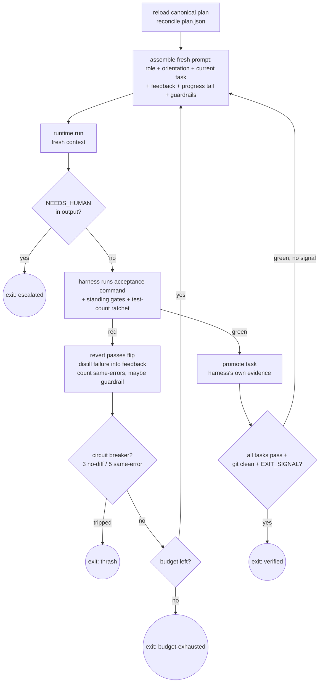

# GoalLoop internals

*One iteration, mechanism by mechanism. The defining property throughout: the
harness owns completion — the model's word moves nothing.*



## The shape

```python
class GoalLoop:                                     # studio/loop.py
    def run(self, base_prompt, workdir, goal: Goal) -> LoopResult
# Goal: extra gates + budgets (max_iterations, max_minutes)
# LoopResult.reason ∈ {verified, budget-exhausted, thrash, escalated, aborted}
#   → process exit codes 0 / 1 / 2 / 3
```

Every iteration is a **fresh runtime invocation** — no conversation carryover, per
the [Ralph principle](../concepts/03-the-ralph-loop.md). All state between
iterations lives in three files under `<worktree>/.loop/` (gitignored — loop
state never rides along in the PR):

## The three files

**`plan.json`** — the priority queue. A planning iteration runs first ("plan only,
do NOT implement"): the agent decomposes the design spec's acceptance criteria into
tasks — `{id, title, steps, acceptance_command, priority, passes, notes}` — plus
standing `gates` (test, lint, smoke). JSON, not markdown: models tamper less with
structured data. The harness immediately snapshots a **canonical copy**
(`plan.canonical.json`), and from then on `_reconcile_plan` rewrites `plan.json`
from canon at the top of every iteration, keeping only the agent's `notes`. Task
text, commands, order, gates: immutable. `passes`: **harness-owned** — see below.

**`progress.md`** — the append-only handoff log. Each iteration gets an entry: what
was attempted, the gate report (the harness writes this block even when the agent
didn't), learnings for the next iteration. A `## Codebase Patterns` section at the
top collects promoted reusable insights. Written for a reader with zero context,
because that is literally who reads it next.

**`guardrails.md`** — accumulated signs, formalized as
Trigger / Instruction / Reason / Provenance. The harness auto-appends one when the
same gate fails with substantially the same error a third time ("stop repeating the
approach; try something substantially different"). Humans can append too. Injected
at the **end** of every prompt — last words win.

## Harness-owned completion, precisely

The core loop of `_verify`, in order:

1. Identify the current task: highest-priority `passes: false` **in the canonical
   plan** — an agent that flipped flags in plan.json changed nothing, because
   reconcile already threw those flips away.
2. Run the task's `acceptance_command` and every gate through the executor. Exit
   codes are the only testimony admitted.
3. **Test-count ratchet:** count `def test_` functions across test files; a drop
   below the last green count fails the gate outright and appends a guardrail —
   tests may be added, never deleted (Anthropic: "it is unacceptable to remove or
   edit tests").
4. Red → revert any `passes` flip, distill the failing command + last 50 lines of
   its output into the next prompt's `## Why the previous iteration did not
   complete` section. Feedback injection *is* the steering.
5. Green → the harness itself promotes the task (in plan **and** canon — even if
   the agent forgot to flip it; truth is truth).
6. All tasks green → three more conditions: gates green on **committed** work
   (`git status --porcelain` must be empty — "done but uncommitted" is not done),
   and the agent must emit `EXIT_SIGNAL: COMPLETE`. The signal alone never
   completes (frankbria's dual gate); green *without* the signal triggers one
   confirmation iteration — a final self-review with fresh eyes.

The keystone test, `tests/test_loop.py::test_lying_agent_does_not_complete`, scripts
an agent that flips every flag and shouts the signal while a gate still fails — and
asserts the loop exits non-verified with the failure recorded and injected. It
earned its keep during construction: the first reconcile implementation merged agent
`passes` flips, and this test is what caught it. Main `verify.sh` check #13 pins it
forever.

## Stop rules — losing well

OR-combined, each with a distinct exit reason so the orchestrator can branch:

| Rule | Threshold | Exit |
|---|---|---|
| iteration budget | `max_iterations` (default 10) | `budget-exhausted` (1) |
| wall clock | `max_minutes` (default 90) | `budget-exhausted` (1) |
| no-diff breaker | 3 consecutive iterations with identical git fingerprint | `thrash` (2) |
| same-error breaker | 5 consecutive identical gate failures | `thrash` (2) |
| agent escalation | `NEEDS_HUMAN: <question>` in output | `escalated` (3) |

Every non-verified exit writes a structured report to `progress.md`; the
orchestrator copies it onto the work item and parks it in `needs-human`. Resume is
free by construction: state is files, so a re-dispatch continues from the first
`passes: false` task. [Lab 4](../labs/04-watch-the-loop-save-itself.md) triggers
every one of these mechanisms on purpose.

## What to tune, and what to leave alone

Tune per-agent budgets in `studio.yaml` (`loop: {max_iterations, max_minutes}`) —
bigger tasks earn bigger budgets, but prefer smaller tasks. Tune the *inputs*:
sharper acceptance criteria shrink iterations more than any budget increase. Leave
alone: the reconcile/ratchet/clean-tree checks. Each exists because a named failure
mode ([research §4](../../research/loop-engineering-research.md)) walked through the
door it now blocks; loosening them re-opens the door quietly, and you'll meet the
failure at 3am instead of in a test.

---

[← Agents, skills, runtimes](04-agents-skills-runtimes.md) · [Index](../README.md) ·
[Orchestrator and safety →](06-orchestrator-and-safety.md)
