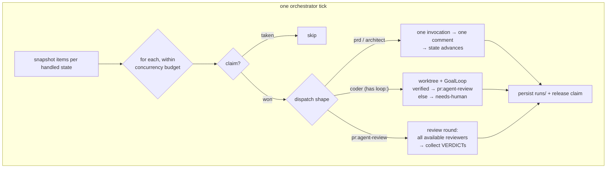

# Orchestrator and safety

*Plain code, no LLM: the tick that moves everything, and the enforcement stack that
keeps a fully confused agent's blast radius small.*

## The tick

`studio/orchestrator.py` — the whole control plane is one method. Each tick:
**snapshot** every item in every state that has a registered agent (snapshot first,
so an item that transitions mid-tick — coder finishing into review — is *not*
dispatched twice in one pass); then for each item, within
`max_concurrent_agents`: claim it, dispatch by shape, apply the outcome transition,
persist the full prompt+output under `runs/<stamp>-<item>-<agent>/`, release the
claim. Items in human-gated states have no registered agent — skipping them is
structural, not policy ([state machine](02-state-machine.md)).

Modes: `--once` (one tick — cron-friendly and what tests use), `--watch` (poll every
`poll_interval_s`), `--dry-run` (print what *would* dispatch, touch nothing). One
line per tick lands in `.agent-logs/orchestrator.log`.

## The three dispatch shapes

**Commenters** (prd, architect). One fresh invocation → the output posted as ONE
comment → the agent-actor transition (`prd:drafting → prd:review`). Empty output or
a non-zero exit leaves the state untouched — the next tick simply retries; no state
is corrupted by a flaky model call.

**The coder** (any agent with a `loop:` block — such agents are also auto-registered
for `pr:changes-requested`, so review feedback flows back to them). The orchestrator
cuts or reuses a worktree at `../.studio-worktrees/<item>` on branch
`agent/<id>-<slug>`, then hands off to the [GoalLoop](05-goal-loop-internals.md).
`verified` → a gate-report comment and `pr:agent-review`. Anything else → the
progress report as a comment and `needs-human`. The loop's exit *reason* decides the
routing — that's why exit reasons are distinct values, not a boolean.

**Review rounds** (`pr:agent-review`). Every *available* reviewer runs — each
comments its full review and must end with a machine-parseable verdict line. The
orchestrator's rules are deliberately mechanical:

- `VERDICT: APPROVE` or `VERDICT: CHANGES` — last occurrence wins; **a missing or
  unparseable verdict counts as CHANGES** (fail closed).
- All approve → `pr:human-review` (orchestrator actor — the one automated promotion,
  and it still only reaches *your* gate). Any CHANGES → `pr:changes-requested`.
- **Degraded review:** if a reviewer's runtime is unavailable (`codex` not
  installed), the round proceeds with those present when
  `allow_degraded_review: true`, and posts a comment saying so — visible in the PR
  history, never silent. Set it `false` and the round skips instead, holding the
  item until you install the second model or lower `approvals_required`.

## The enforcement stack, assembled

Part 1 introduced the [three layers](../concepts/02-anatomy-of-a-harness.md); here
is the full stack this repo ships, bottom to top:

| Layer | Mechanism | What it stops |
|---|---|---|
| environment | scoped token, dedicated VPS user ([deploy/vps.md](../../deploy/vps.md)) | anything in-process controls miss |
| harness | `studio/state.py` actor checks | agents approving specs or reaching `done` |
| harness | GoalLoop gates + canonical plan + ratchet | lying about completion, weakening the contract |
| harness | `.claude/settings.json` deny rules | `gh pr merge`, pushes to main, reading `.env`/keys |
| harness | `guard.sh` PreToolUse hook (**exit 2 blocks**) | rule-evading variants: force pushes, hard resets to main, repo-level `rm -rf` — each block logged to `.agent-logs/blocked.log` |
| harness | `audit.sh` PostToolUse hook | nothing — it's the flight recorder: JSONL per tool call, size-rotated |
| intent | [AGENTS.md](../../AGENTS.md), prompts, skills | honest confusion (and nothing else) |

The redundancy is deliberate: "agents never merge" is enforced three independent
ways. Layers fail differently — prompts silently, patterns on variants — and the
stack is designed so each layer's misses land in the next one down
([why layered](../concepts/02-anatomy-of-a-harness.md)).

## Observability

You can always answer "what happened?", at four zoom levels: `studio status` (the
board plus a Needs-you list) → the item's comment thread (the narrative: PRD, design,
gate reports, reviews) → `runs/` (every prompt and output verbatim) →
`.agent-logs/` (every tick, every tool call, every block).
[Troubleshooting](../guide/05-troubleshooting.md) is a tour of reading them under
stress.

---

[← GoalLoop internals](05-goal-loop-internals.md) · [Index](../README.md) ·
[Observability →](07-observability.md)
