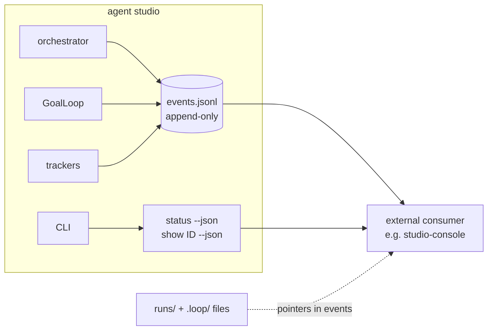

# Observability

*The public contract for watching the studio work: a versioned event stream plus
snapshot commands. External tools build on this — never on internals.*



## The contract, in four pieces

External consumers (the reference one is
[studio-console](../../../studio-console/README.md)) may rely on exactly these, and
nothing else:

1. **The event stream** — `<studio-root>/.agent-logs/events.jsonl`. One JSON object
   per line; **file append order is canonical** (`seq` is per-writer advisory,
   since a `--watch` process and a CLI command may interleave; sub-4KB line appends
   are atomic on POSIX). The writer rotates to `events.jsonl.1` at ~10MB —
   consumers must survive rotation and truncation by reopening.
2. **Snapshot commands** — `python -m studio status --json` (the board:
   `{generated, items: [{id, title, state, kind, claimed_by, updated, url}]}`) and
   `python -m studio show <id> --json` (one item, including
   `comments: [{author, body}]`). Both work from any directory via `--config`.
3. **Run artifacts** — `runs/<stamp>-<item>-<agent>/{prompt.md,output.md}`;
   `runtime_start` events carry the `run_dir`.
4. **Loop files** — the worktree's `.loop/{plan.json,progress.md,guardrails.md}`;
   `loop_start` events carry the `workdir`.

## The envelope

```json
{"v": 1, "seq": 42, "ts": "2026-07-07T15:07:16+00:00", "kind": "gate_result",
 "item": "3", "agent": "coder", "data": {"command": "pytest -q", "ok": true, "gate_tail": "..."}}
```

`item`/`agent` are null when not applicable. Excerpt fields in `data` are tails,
capped centrally (`output_tail`/`comment_tail` ≤ 2000 chars, `gate_tail` ≤ 1000) —
the full text always lives in the pointed-at files. Implementation:
`studio/events.py` (`EventLog`; components take a constructor-injected log
defaulting to `NullEventLog`, so observability can never break the work — emit
errors are swallowed by design).

## Event kinds (v1)

| kind | emitted by | data |
|---|---|---|
| `tick_start` / `tick_end` | orchestrator | `{n}` / `{n, dispatched, skipped}` |
| `dispatch_start` | orchestrator | `{shape: commenter\|coder\|review-round}` |
| `dispatch_end` | orchestrator | `{action, detail}` (one per Dispatch) |
| `runtime_start` | orchestrator / loop | `{runtime, run_dir, prompt_chars}` (`run_dir` null inside the loop) |
| `runtime_end` | orchestrator / loop | `{exit_code, duration_s, output_tail}` |
| `loop_start` | GoalLoop | `{workdir, max_iterations, max_minutes, tasks_total, tasks_passed}` |
| `iteration_start` | GoalLoop | `{n, task_id, task_title}` (task null in planning/confirmation) |
| `gate_result` | GoalLoop | `{command, ok, gate_tail}` |
| `task_passed` | GoalLoop | `{task_id, tasks_passed, tasks_total}` |
| `guardrail_added` | GoalLoop | `{trigger}` |
| `loop_exit` | GoalLoop | `{reason, iterations, wall_time_s}` |
| `agent_output` | orchestrator / loop, *during* an invocation | `{chunk, channel, done}` — live streamed output |
| `item_created` | tracker | `{title, kind, state}` |
| `transition` | tracker | `{from, to, actor}` |
| `comment_added` | tracker | `{author, chars, comment_tail}` |
| `claimed` / `released` | tracker | `{agent}` (idempotent re-claims emit nothing) |

`agent_output` is the live channel: while a runtime invocation runs (streaming
runtimes only — `runtimes.<name>.streaming` in config, default true for claude via
`--output-format stream-json --verbose`), the agent's incremental output arrives as
coalesced chunks. `channel` is `"text"` (assistant prose) or `"tool"` (a one-line
tool-use notice); `done: true` marks an invocation's final flush (its chunk may be
empty). Chunks are capped at 2000 chars and batched by an OutputCoalescer (flush at
≥400 chars or ≥1s) so a long invocation emits tens of events, not thousands.
Consumers wanting a live view buffer chunks per item and drop the buffer on
`dispatch_end`; the *complete* output is still in the `runtime_end` tail and the
run's `output.md`.

Loop events arrive with `item`/`agent` filled because the orchestrator binds the
loop's log per dispatch (`events.bound(item=..., agent=...)`) — the GoalLoop itself
stays ignorant of work items, as designed.

## Versioning policy

Within `v: 1`: changes are **additive only** — new kinds, new data fields.
Consumers must tolerate unknown kinds and unknown fields (render raw, don't
crash). Renaming or removing anything bumps `v`, and consumers should surface a
version-mismatch warning rather than guess. The reference consumer's parser and
this table are kept in lockstep by studio-console's integration check, which runs
a real demo and parses the fresh stream.

## Watching without a consumer

The stream is just a file — the zero-install console is:

```sh
tail -f .agent-logs/events.jsonl | jq -r '[.ts, .kind, .item // "-", .agent // "-"] | @tsv'
```

And `studio demo --keep` prints a sandbox path whose
`studio/.agent-logs/events.jsonl` holds a complete lifecycle (~90 events, all 16
kinds) — the fixture source for any tool you build on this contract.

---

[← Orchestrator and safety](06-orchestrator-and-safety.md) · [Index](../README.md) ·
[Part 3: Install and first run →](../guide/01-install-and-first-run.md)
