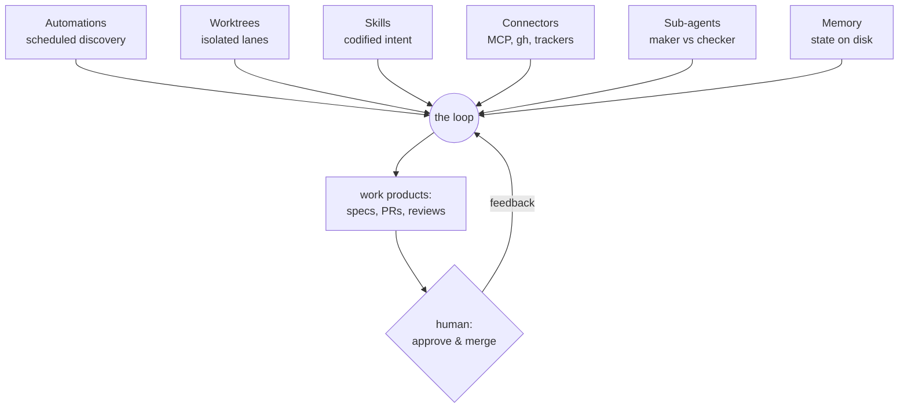

# From prompts to loops

*The leverage shift that defines loop engineering, the six components every loop
system shares, and the autonomy slider that decides how much you delegate.*

## The leverage shift

The leverage point in AI-assisted development has moved twice. First from writing
code to writing prompts. Then from writing prompts to **designing the systems that do
the prompting**. Andrej Karpathy calls the destination *agentic engineering*; Addy
Osmani names the practice in
[Loop Engineering](https://addyosmani.com/blog/loop-engineering/):

> Loop engineering is replacing yourself as the person who prompts the agent. You
> design the system that does it instead.

A loop is a recursive goal: you define the purpose and the machinery — discovery,
execution, verification, iteration — and the system runs until a condition you wrote
is actually true. You stop issuing tasks in a chat window; you file work items and
review outcomes. In Agent Studio, "designing the system" happened once, in
[spec.md](../../spec.md); operating it is `studio new` and `studio approve`.

## The six components

Osmani's decomposition holds across every serious implementation surveyed in the
[field guide](../../agentic-engineering-field-guide.md); here is each component and
where it lives in this repo:

| Component | What it does | In Agent Studio |
|---|---|---|
| **Automations** | The heartbeat: work gets discovered and dispatched without you prompting | the orchestrator's `studio run --watch` poll loop |
| **Worktrees** | Parallel lanes so concurrent agents never collide on files | `../.studio-worktrees/<item>` per coding task, branch `agent/<id>-<slug>` |
| **Skills** | Intent codified once, so the loop stops re-deriving your project every cycle | `.claude/skills/*/SKILL.md`, preloaded or inlined per runtime |
| **Connectors** | Reach beyond the filesystem: trackers, CI, chat | the `gh` CLI (and an MCP passthrough for later) |
| **Sub-agents** | "The most useful structural thing in a loop": split the maker from the checker | prd/architect/coder vs two reviewers on different models |
| **Memory** | "The agent forgets, the repo doesn't" — state lives on disk | the tracker itself, `memory/*/journal.md`, `.loop/` files |

The point of the table isn't the mapping — it's that **the shape is standard**. Once
you see these six in one tool you'll recognize them in every other (Claude Code and
Codex both ship all six), and you can design loops that survive switching tools.

## The autonomy slider

Autonomy is not a boolean; it's a dial, and where you set it is the whole game:

| Level | The loop... | Example |
|---|---|---|
| 0 — Copilot | acts only when you type | autocomplete |
| 1 — Suggested | proposes, you approve each step | goal-mode stopping every step |
| 2 — Per-step review | runs, pauses between phases | **Agent Studio's default**: you gate specs and merges |
| 3 — Batch review | runs fully, you review the result | nightly triage digest |
| 4 — Self-fork | files its own fix-PRs, keeps going | kanban workers with auto-claim |
| 5 — Meta-loop | loops that modify other loops | a curator pruning stale skills |

Agent Studio sits at level 2 by construction: the state machine's human-only
transitions (`prd:review → prd:approved`, `pr:human-review → done`) cannot be taken
by an agent — see [the state machine](../architecture/02-state-machine.md). Running
it 24/7 on a VPS pushes the *cadence* toward level 3, but the gates stay yours.
Every source in the field guide converges on the same rule, and
[autonomy and safety](05-autonomy-and-safety.md) develops it: **start at 2, dial up
only after the checker has proven itself.**

## What changes for you

Prompting is a conversation; looping is management. Your work becomes: write the
request well (Lab 1), review the PRD and design hard (that steering is cheap —
rejecting a spec costs a comment; rejecting an implementation costs a rebuild), read
what the loop produced, and keep your judgment sharp. What does *not* change:
shipping code you confirmed works is still your job. The loop multiplies your hands,
not your accountability — the boundary is drawn precisely in
[verification is the bottleneck](04-verification-is-the-bottleneck.md).

---

[Index](../README.md) · [Anatomy of a harness →](02-anatomy-of-a-harness.md)
