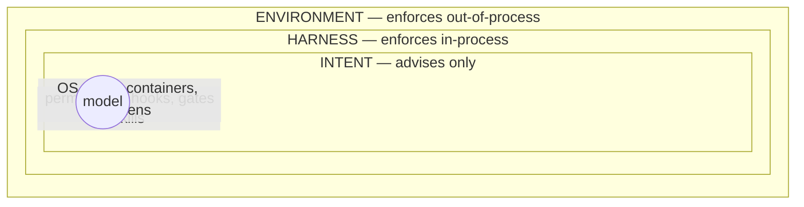

# Anatomy of a harness

*An agent is a model plus a harness. The model brings intelligence; the harness —
everything that isn't the model — makes it useful, and it's the part you control.*

## Agent = Model + Harness

LangChain's [Anatomy of an Agent Harness](https://www.langchain.com/blog/the-anatomy-of-an-agent-harness)
gives the field its cleanest equation. The harness is every piece of code,
configuration, and execution logic wrapped around the model: system prompts, tool
descriptions, filesystem and sandbox, orchestration logic, hooks. Models alone can't
maintain state across sessions, execute code, or verify their own claims — the
harness supplies all of that. And it's a big lever on its own: LangChain improved
benchmark placement **by changing the harness alone**, same model.

The six harness components, and their Agent Studio incarnations:

| Component | In this repo |
|---|---|
| Filesystem | the tracker's files, `memory/`, `.loop/`, `runs/` — plus git for versioning and rollback |
| Code execution | every gate command the GoalLoop runs; agents get a real shell |
| Sandboxes | worktrees locally; a locked-down VPS user in production ([deploy/vps.md](../../deploy/vps.md)) |
| Memory & search | journals, `AGENTS.md`, skills — knowledge that survives the context window |
| Context management | fresh context per loop iteration, with structured handoff files |
| Long-horizon execution | the [GoalLoop](../architecture/05-goal-loop-internals.md) itself |

## The three enforcement layers

The diagram above is the safety model, from Hidekazu Konishi's
[harness and environment engineering guide](https://hidekazu-konishi.com/entry/claude_code_harness_and_environment_engineering_guide.html)
(distilled in the [field guide](../../agentic-engineering-field-guide.md) §3). The
misconception it demolishes: rules in a CLAUDE.md or system prompt are **not
enforced** — they are "text that becomes part of the model's context" with no
enforcement layer behind them. A model can ignore them; a confused model *will*.

| Layer | What it does | Agent Studio |
|---|---|---|
| **Intent** | *Advises.* Shapes what the agent tries. | [AGENTS.md](../../AGENTS.md), the role prompts, the skills |
| **Harness** | *Enforces in-process.* Shapes which tool calls dispatch. | `.claude/settings.json` allow/deny rules; `guard.sh` (a PreToolUse hook where **only exit code 2 blocks**); the state machine's actor checks; the GoalLoop's gates |
| **Environment** | *Enforces out-of-process.* Shapes what can actually happen. | a scoped GitHub token that *can't* merge; a dedicated VPS user with nothing to steal; egress rules |

The design rule that follows, and that this repo applies everywhere: **anything that
must be true lives in the harness or the environment — never only in a prompt.**
Agents "must never merge" appears three times here: as a sentence in AGENTS.md
(intent), as a deny rule plus a guard-hook regex (harness), and as a token without
merge rights in production (environment). Layer one is for the model's benefit;
layers two and three are for yours.

## Why layered, not just strict

Each layer fails differently. Prompts fail silently (the model just... doesn't
comply). Permission rules fail on variants (`git push origin main` denied, but a
creative `git push origin HEAD:main` slips a naive pattern — which is exactly why
`guard.sh` matches semantics, not exact strings, and logs every block to
`.agent-logs/blocked.log`). The environment backstops both: when the token can't
merge, no in-process failure matters. Konishi's graduated patterns — approval-first →
curated allow-list → sandboxed full-auto — are the same idea over time: you relax a
layer only when the layer beneath it has proven it will catch what slips through.

One more harness lesson from Anthropic's
[long-running harness work](../../research/loop-engineering-research.md): every
harness component encodes an assumption about what the model *can't* do, and those
assumptions go stale as models improve. They deleted half their scaffolding after a
model upgrade with no quality loss. Hence this repo's design tenet: *no mechanism
without a failure mode it prevents* — and re-test which mechanisms still earn their
keep after every model generation.

---

[← From prompts to loops](01-from-prompts-to-loops.md) · [Index](../README.md) ·
[The Ralph loop →](03-the-ralph-loop.md)
