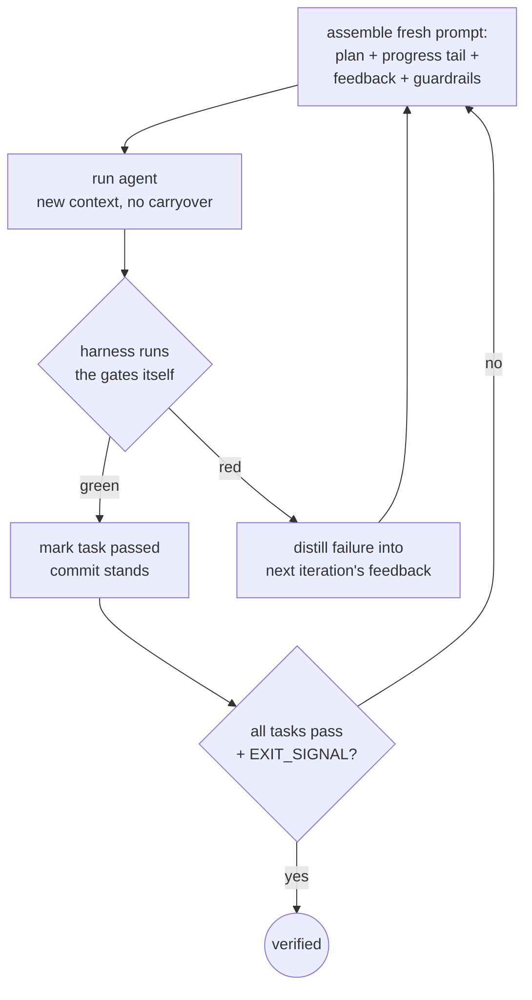

# The Ralph loop

*Fresh context every iteration, all memory in files, one task at a time, a harness
that never takes the model's word — the technique behind this system's coder.*



## The original: deliberately dumb

Geoffrey Huntley's [Ralph](https://ghuntley.com/ralph/) is the whole idea in one
line of bash:

```bash
while :; do cat PROMPT.md | claude-code ; done
```

Every pass is a brand-new process with a fresh context window. The model remembers
nothing; **the files remember everything**: a prompt, a prioritized plan
(`fix_plan.md`) the agent marks items off in, specs as the source of truth, and an
operational notes file. Huntley called the failure mode this exploits "deterministic
failure in nondeterministic ways" — you tune the *operator* (prompts, plans, signs),
not the tool, and ran it three months straight to
[build a programming language](https://ghuntley.com/cursed/).

Three disciplines make the dumb loop work, and every descendant keeps them:

- **One item per loop.** Each iteration does exactly one discrete task, staying in
  the context window's "smart zone". One iteration = one task = one commit.
- **Signs, not rewrites.** Steering happens by *appending* guardrails ("SLIDE DOWN,
  DON'T JUMP") rather than editing the prompt — accumulated lessons that every
  future iteration reads.
- **Backpressure.** Deterministic feedback that rejects fake progress: tests,
  typecheck, lint, build. Without it the loop optimizes for *looking* done.

## What the descendants added

The [loop-engineering research report](../../research/loop-engineering-research.md)
surveys the 2026 implementations; the consensus upgrades over the naive while-loop:

| Mechanism | First seen in | Why |
|---|---|---|
| Plan as JSON with per-task `passes` flags | snarktank/ralph, Anthropic | models tamper less with structured data; only the flag is meant to change |
| Completion verified by the harness, never claimed | vercel-labs, `/goal` | "premature victory declaration" is a named failure mode |
| Failure reason injected into the next prompt | vercel-labs, ralphex | the loop's feedback IS the steering |
| Circuit breakers (no-progress / same-error) | frankbria | thrash detection beats burning the budget |
| Layered budgets: iterations ∨ wall-clock ∨ cost | ralph-orchestrator | "max-iterations is your primary safety mechanism" |
| Plan/build phase separation | ralph-playbook, Anthropic | "plan only, do NOT implement" produces better queues |

Claude Code's `/goal` is the same architecture productized: after every turn, a
separate small model — deliberately *not* the one doing the work — evaluates the
transcript against your condition and either stops or re-prompts with the reason it
isn't done. Fresh skeptical eyes, cheap, every turn.

## This repo's implementation

`studio/loop.py` (`GoalLoop`) implements the consensus list, with the research
report's §4 as its normative checklist. The pieces you'll meet in
[GoalLoop internals](../architecture/05-goal-loop-internals.md):

- `.loop/plan.json` — the priority queue, with a **canonical copy the agent cannot
  edit**; `passes` is decided by the harness's own gate runs, full stop.
- `.loop/progress.md` — the append-only handoff log; each iteration writes for a
  reader with zero context, because that's exactly who the next iteration is.
- `.loop/guardrails.md` — Huntley's signs, formalized (Trigger / Instruction /
  Reason / Provenance) and auto-appended after three identical failures.
- Stop rules with distinct exit codes: `verified`, `budget-exhausted`, `thrash`,
  `escalated` — so the orchestrator can branch on *why* the loop ended.

## Why fresh context beats one long session

Long sessions rot: the model drags stale hypotheses forward, "context anxiety" makes
it wrap up prematurely, and compaction loses the wrong details. Anthropic's
long-running-agent work found **full context resets with structured handoff files
beat compaction** — which is the Ralph architecture arrived at from the opposite
direction. The trade is honest: you pay a re-orientation cost every iteration (hence
the orientation ritual: read the log, read the plan, run the gates *before* touching
anything), and in exchange every iteration reasons from the actual state of the
world, not from what it remembers believing twenty minutes ago.

Scope discipline, from every source at once: Ralph loops shine on **spec-driven,
machine-checkable work** — exactly what this pipeline feeds the coder, a design spec
whose acceptance criteria are shell commands. Vague goals in, thrash out.

---

[← Anatomy of a harness](02-anatomy-of-a-harness.md) · [Index](../README.md) ·
[Verification is the bottleneck →](04-verification-is-the-bottleneck.md)
