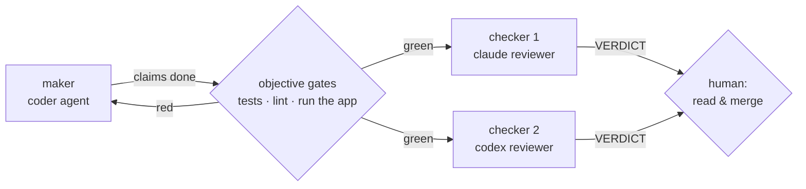

# Verification is the bottleneck

*Models generate faster than anyone can check. Every structural choice in this
system — split roles, gates, harness-owned completion — exists to make verification
cheap.*

## The thesis

From Karpathy's Sequoia talk
([From vibe coding to agentic engineering](https://www.youtube.com/watch?v=96jN2OCOfLs)):

> Verifiability is the bottleneck. If you can't cheaply verify output, the AI's
> utility collapses.

LLMs are jagged — brilliant at one task, inexplicably bad at its neighbor — so the
value of their output is bounded by your ability to check it. That's why he argues
the most valuable engineering work right now is **building verification harnesses,
not writing code**: human attention is the scarce resource, and every architecture
in the [field guide](../../agentic-engineering-field-guide.md) is a machine for
converting expensive human attention into cheap automated verification.

## Makers never check their own work

Three independent lines of work converged on the same split:

- Osmani, from practice: sub-agents separating implementation from review are "the
  most useful structural thing in a loop" — "the model that wrote the code is way
  too nice grading its own homework."
- Anthropic, from their
  [harness research](https://www.anthropic.com/engineering/harness-design-long-running-apps):
  "making generators self-critical proved difficult, but tuning a standalone
  evaluator to be skeptical turns out to be far more tractable." Their fix was a
  GAN-inspired generator/evaluator split.
- The Python reference loop in the field guide: designer → coder → reviewer, where
  "the reviewer must not be the coder" — *the separation is the win, not the model
  size*.

Agent Studio takes the split twice. The coder never reviews its own PR; and the two
reviewers run on **different models** (Claude and Codex), because two instances of
the same model share blind spots. Both must independently emit `VERDICT: APPROVE` —
an argument between them costs tokens; a shared hallucination costs a production
incident.

## Objective gates before subjective review

Order matters. A reviewer's judgment is expensive and fuzzy; a test suite's is cheap
and binary. So gates run first, and *evidence* — not claims — reaches the reviewer:
in this system reviewers are instructed to re-run the gates themselves ("never trust
pasted output", [prompts/reviewer.md](../../prompts/reviewer.md)), and any failing
gate is an automatic CHANGES with no judgment involved. This is Huntley's
backpressure generalized: put the deterministic checks upstream of the probabilistic
ones, and the probabilistic ones get to spend their capacity where it counts.

The prerequisite is that acceptance criteria be *runnable*: a criterion is a shell
command that exits 0 (see the
[acceptance-criteria skill](../../.claude/skills/acceptance-criteria/SKILL.md)).
"Handles errors gracefully" cannot gate anything; `curl ... | grep -q 400` can.

## Harness-owned completion

The strongest form of the principle, and this repo's defining property: **the
harness decides when work is done, and the model's word is never sufficient.**
"Premature victory declaration" and "marking features complete without testing" are
named failure modes in Anthropic's
[long-running-agent research](../../research/loop-engineering-research.md); this is
the countermeasure. Concretely, in `studio/loop.py:_verify`:

- The agent flipping every `passes` flag and shouting `EXIT_SIGNAL: COMPLETE`
  changes nothing — the plan is reconciled from a canonical copy, and a task passes
  only when the *harness's own* run of its acceptance command and the gates is green.
- Deleting tests to get green fails: test functions are counted every run, and a
  drop below the previous green count fails the gate (the ratchet).
- Green with uncommitted work isn't done: `git status` must be clean.

There is a test that proves all of this (`tests/test_loop.py::
test_lying_agent_does_not_complete`), and it earned its keep: during this system's
own construction it caught a reconciliation bug that let a lying agent through.
Verification machinery gets verified too.

## What stays yours

Gates check that the thing was built right; only you can check it's the right thing.
The human gates in this pipeline are not ceremony — they are the two judgments no
gate can make: *is this spec what I actually want?* and *do I understand and accept
this change?* [Autonomy and safety](05-autonomy-and-safety.md) is about protecting
your capacity to keep making them.

---

[← The Ralph loop](03-the-ralph-loop.md) · [Index](../README.md) ·
[Autonomy and safety →](05-autonomy-and-safety.md)
