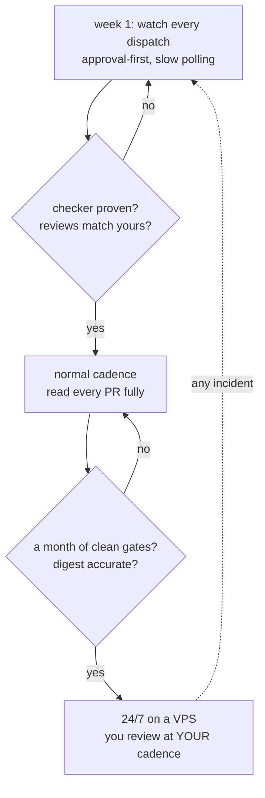

# Autonomy and safety

*Autonomy is earned, not configured. Stop rules and budgets keep the loop from
hurting you at 3am; your own reading keeps it from hollowing you out over months.*

## The trust ladder

Every source in the [field guide](../../agentic-engineering-field-guide.md) that has
actually operated loops — Osmani, Konishi, the 24/7 playbook — lands on the same
protocol: **start small, expand responsibilities as trust builds.** Konishi's
graduated patterns (approval-first → curated allow-list → sandboxed full-auto), the
autonomy slider from [concepts/01](01-from-prompts-to-loops.md), and the ladder
above are one idea at three zoom levels. The promotion criterion is never "it seems
fine"; it's specific evidence: *the reviewer's comments are ones you'd have made;
the guard hook verifiably blocks what it must; you disagreed with the loop at least
once and tuned it.* The [VPS guide](../../deploy/vps.md) operationalizes this.

## Stop rules: the loop must know how to lose

A loop without a stop rule doesn't fail — it *thrashes*, indefinitely, at your
expense. The reference implementation's rule ("40 minutes or 10 iterations without
crossing the finish line → STOP and write a progress report") exists because, as the
field guide puts it, loops without stop rules are how you wake up to a $400 bill and
a repo full of thrash. Agent Studio's GoalLoop layers them, OR-combined, each with a
distinct exit code (details in
[GoalLoop internals](../architecture/05-goal-loop-internals.md)):

- **Budgets** — `max_iterations` (default 10), `max_minutes` (default 90).
- **Circuit breakers** — three iterations with no diff, or five with the same error:
  the loop is going in circles; stop before the budget burns.
- **Escalation** — the agent itself can declare `NEEDS_HUMAN:` and stop; a stated
  blocker costs a minute, a guessed answer can cost a day.

Losing well is a feature: every non-verified exit writes a structured progress
report to the work item and parks it in `needs-human`. The failure arrives on your
desk as a readable artifact, not as a mystery balance on an invoice.

## What loops never absorb

From [Osmani](https://addyosmani.com/blog/loop-engineering/), the three problems no
amount of harness fixes — the reason the human gates in this system are permanent,
not training wheels:

1. **Verification stays yours.** "A loop running unattended is also a loop making
   mistakes unattended." The gates prove the code does what the spec says; only you
   can decide the spec was right.
2. **Comprehension debt accelerates.** "The faster the loop ships code you did not
   write, the bigger the gap between what exists and what you actually get." Stop
   reading the diffs and you lose the ability to judge them — then to steer at all.
3. **Cognitive surrender.** "When the loop runs itself it's very tempting to stop
   having an opinion." Two people can run the same loop and get opposite outcomes:
   one moves faster on work they understand deeply; the other stops understanding
   the work at all.

The practical countermeasures are small and daily: read the PR before merging (Lab 1
calls this the anti-cognitive-surrender rep), push back on at least some specs (Lab
2 makes you), and read the agents' journals occasionally — they show you what the
system believes about your project.

## Safety as architecture

At level 2 autonomy, mistakes are annoying; at 24/7, "safety becomes architecture"
([Running Claude Code 24/7](https://www.howdoiuseai.com/blog/2026-02-13-running-claude-code-24-7-gives-you-an-autonomous-c)).
The floor this repo ships, layer by layer
([anatomy of a harness](02-anatomy-of-a-harness.md)):

- Agents never merge, never push to main, never approve specs — state-machine actor
  checks, deny rules, and the guard hook all enforce it independently.
- Every tool call is logged (`.agent-logs/audit.jsonl`), every block is logged
  (`blocked.log`), every dispatch is persisted (`runs/`) — you can always answer
  "what did the agents do on Tuesday?"
- Every loop has budgets and breakers; the orchestrator caps concurrent agents.
- In production: a dedicated user, a repo-scoped token, and nothing worth stealing —
  so even a fully confused agent has a bounded blast radius.

> Build the loop. But build it like someone who intends to stay the engineer, not
> just the person who presses go. — Osmani

---

[← Verification is the bottleneck](04-verification-is-the-bottleneck.md) ·
[Index](../README.md) ·
[Part 2: System overview →](../architecture/01-system-overview.md)
