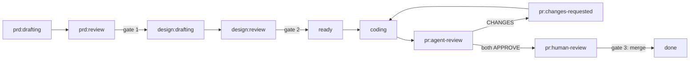

# Install and first run

*From clone to a green demo in five minutes — and what every line of the demo output
is actually telling you.*

## Prerequisites

| Tool | Needed for | Check |
|---|---|---|
| Python ≥ 3.11 | the harness itself | `python3 --version` |
| [uv](https://docs.astral.sh/uv/) (or plain venv+pip) | environment setup | `uv --version` |
| git | everything | `git --version` |
| Claude Code CLI, authenticated | the claude runtime | `claude --version` |
| GitHub CLI, authenticated | the github tracker (later) | `gh auth status` |
| Codex CLI | reviewer-b (optional — degrades gracefully) | `codex --version` |

Only the first three are needed for the demo. The demo requires **no API keys and no
network**: agents are scripted fakes; the harness around them is entirely real.

## Install

```sh
git clone <this-repo> && cd agent-studio
uv venv .venv && uv pip install --python .venv/bin/python -e . pytest pytest-cov ruff
make verify    # the system proving itself: 13 checks, ~30s
make demo      # the full lifecycle, narrated
source .venv/bin/activate   # so `python -m studio ...` resolves here
```

If `make verify` prints `score: 13/13`, everything works. If it doesn't, something
about your environment is off *before* you've invested anything — see
[troubleshooting](05-troubleshooting.md).

## Reading the demo output

`make demo` prints the whole story — one item traversing every state, with you (the
scripted "you") at the three gates:



The important beats, in order:

```text
== you file a feature request (studio new)
   item #1 state: prd:drafting
```

A work item enters the queue and immediately moves to the PRD agent's state. In real
use this is `python -m studio new "..."`.

```text
== tick: prd agent drafts the PRD
   item #1 state: prd:review
```

One orchestrator tick: the item was claimed, the (scripted) prd agent produced ONE
comment, and the agent-actor transition fired. `prd:review` is a human gate — no
tick will ever move it; only the next line does:

```text
== you approve the PRD (studio approve)
   item #1 state: design:drafting
```

The same rhythm repeats for the design. Then the interesting one:

```text
== tick: coder's GoalLoop plans, builds, and the HARNESS verifies the gates
   item #1 state: pr:agent-review
```

Inside that line: a git worktree was created, a planning iteration wrote
`.loop/plan.json`, a build iteration created the feature and committed, and the
harness ran the acceptance command itself before promoting anything
([how](../architecture/05-goal-loop-internals.md)).

```text
== tick: review round — reviewer-b (codex) requests changes
   item #1 state: pr:changes-requested
```

The demo scripts a rejection on purpose — you're watching the maker/checker split
do its job. The next two ticks show the coder addressing the blocker and both
reviewers approving; then:

```text
== you read the history and merge (studio approve)
   item #1 state: done

runs persisted: 8
```

Eight dispatches, each with its full prompt and output under `runs/` in the demo's
sandbox directory (printed at the top of the output) — go look at one; it's the
habit that [keeps you the engineer](../concepts/05-autonomy-and-safety.md).

## What to do next

- Poke the harness: `python -m studio status`, `python -m studio run --dry-run
  --once`, `cat .work/board.md` if you've created local items.
- Do [Lab 1](../labs/01-build-an-app.md) — the demo with real agents and a real
  repo, gated by you.
- When ready for a real project: [going live on GitHub](04-going-live-on-github.md).

---

[← Part 2: Orchestrator and safety](../architecture/06-orchestrator-and-safety.md) ·
[Index](../README.md) · [Daily workflow →](02-daily-workflow.md)
