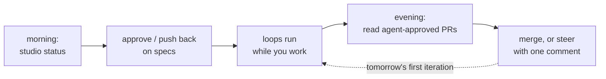

# Daily workflow

*Your day as the human in the loop: one board, two gates, and the reading that keeps
your judgment sharp.*

## The rhythm



Everything routes through one command:

```sh
python -m studio status
```

The board shows every item by state; the **Needs you** section is your entire inbox —
only four states ever appear in it, each with its action:

| State | Your move |
|---|---|
| `prd:review` | read the PRD comment → `studio approve <id>` or comment + send back |
| `design:review` | read the design — the acceptance criteria hardest → approve or push back |
| `pr:human-review` | read the PR and its review history → merge → `studio approve <id>` |
| `needs-human` | read the escalation/progress report → fix the blocker → re-route |

## Gate craft: reviewing specs well

Rejecting a spec costs a comment; rejecting an implementation costs a rebuild — so
spend your attention early. For PRDs: are the requirements *testable as written*?
Is "Out of scope" doing real work? For designs, go straight to the acceptance
criteria section: every criterion should be a command you could run yourself
(the [acceptance-criteria skill](../../.claude/skills/acceptance-criteria/SKILL.md)
is the standard the architect was given). A vague criterion is tomorrow's thrashing
loop — bounce it now:

```sh
gh issue comment 4 --body "AC3 isn't runnable — give me the exact curl + expected code."
# then move it back a step (or just comment; the agent addresses it on re-dispatch)
```

Pushing back is not overhead; it's the highest-leverage steering you have, and the
agents' journals learn your standards from it ([Lab 5](../labs/05-teach-the-team.md)).

## Gate craft: the merge

By the time an item reaches `pr:human-review`, two models have independently run the
gates and approved. Your read is different from theirs: not "does it pass" (proven)
but "do I understand it, and is it what I wanted?" Read the diff, skim the review
thread (the disagreements are the best part), and check the PR body's gate output.
This is the anti-cognitive-surrender rep from
[concepts/05](../concepts/05-autonomy-and-safety.md) — skip it habitually and
you'll lose the ability to steer at all.

## Handling escalations

`needs-human` items arrive with a structured report: what was attempted, what
failed, the loop's exit reason (`thrash` and `budget-exhausted` read differently —
[troubleshooting](05-troubleshooting.md) decodes them). Typical fixes take minutes:
a criterion that couldn't ever pass, a missing dependency in the target repo, a
design contradiction the coder was right to stop at. Fix the input, then re-route:

```sh
# after fixing — send it back to the coder:
# markdown tracker: edit the item's state; github: swap the studio:* label
gh issue edit 5 --remove-label studio:needs-human --add-label studio:ready
```

## Running the loop

However you like:

```sh
python -m studio run --watch      # foreground, polls every poll_interval_s
python -m studio run --once       # one tick — perfect for cron or a key-binding
python -m studio run --dry-run --once   # what WOULD dispatch; touches nothing
```

`--once` from cron is the low-trust mode: work advances only when you've recently
looked. `--watch` on a [VPS](../../deploy/vps.md) is the high-trust mode. Move
between them with evidence, per the
[trust ladder](../concepts/05-autonomy-and-safety.md).

## The five-minute weekly retro

Once a week, read three files and ask one question each:

- `memory/reviewer/journal.md` — any finding recurring? Promote it to
  [AGENTS.md](../../AGENTS.md) (propose via comment; you apply it).
- `memory/coder/journal.md` — is the coder rediscovering the same project fact?
  That fact belongs in a skill or the target repo's CLAUDE.md.
- `.agent-logs/orchestrator.log` — any item bouncing between states repeatedly?
  That's a spec-quality smell, not an agent bug.

---

[← Install and first run](01-install-and-first-run.md) · [Index](../README.md) ·
[Configuration →](03-configuration.md)
