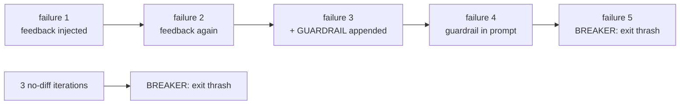

# Lab 4 — Watch the loop save itself

Goal: trigger every defense in the GoalLoop on purpose — feedback injection, the
guardrail at three strikes, both circuit breakers, and escalation — using scripted
agents, entirely offline. After this lab, a `thrash` report in production reads like
a story you've seen before. Time: ~25 minutes. Uses:
[GoalLoop internals](../architecture/05-goal-loop-internals.md).

The defenses escalate on a fixed timeline:



## 1. A sandbox with a loop in it

Save as `scratch/lab04.py` in the studio root (`mkdir -p scratch`):

```python
import json, subprocess, tempfile
from pathlib import Path
from studio.loop import Goal, GoalLoop
from studio.runtime.fake import FakeRuntime

BASE = Path(tempfile.mkdtemp(prefix="lab04-"))
def sh(*a): subprocess.run(a, cwd=BASE, check=False, capture_output=True)
sh("git", "init", "-q"); sh("git", "config", "user.email", "l@b"); sh("git", "config", "user.name", "lab")
(BASE / ".gitignore").write_text(".loop/\n"); sh("git", "add", "-A"); sh("git", "commit", "-qm", "seed")

# a plan whose only task can NEVER pass — the saboteur
(BASE / ".loop").mkdir()
plan = {"gates": [], "tasks": [{"id": "t1", "title": "impossible",
        "acceptance_command": "test -f never.txt", "priority": 1}]}
(BASE / ".loop" / "plan.json").write_text(json.dumps(plan))
(BASE / ".loop" / "plan.canonical.json").write_text(json.dumps(plan))

n = 0
def busy_but_wrong(prompt):        # commits junk every time: progress-shaped motion
    global n; n += 1
    (BASE / f"junk{n}.txt").write_text("effort\n")
    sh("git", "add", "-A"); sh("git", "commit", "-qm", f"junk {n}")
    return "tried something new, confident this time"

rt = FakeRuntime([busy_but_wrong] * 8)
result = GoalLoop(rt).run("build it", BASE, Goal(max_iterations=8))
print("exit reason:", result.reason, "| iterations:", result.iterations)
print("--- guardrails.md ---"); print((BASE / ".loop" / "guardrails.md").read_text())
print("sandbox:", BASE)
```

## 2. Run it and read the wreckage

```sh
.venv/bin/python scratch/lab04.py
```

Checkpoint — the ending:

```text
exit reason: thrash | iterations: 5
```

The **same-error breaker**: five consecutive identical failures of
`test -f never.txt`. It never reached your `max_iterations=8` — the breaker exists
to stop paying for iteration six through infinity. And in the guardrails dump:

```text
- **Trigger:** $ test -f never.txt
  **Instruction:** This exact failure has now happened 3 times. Stop repeating...
  **Provenance:** harness (auto)
```

That appeared at strike three — two iterations *before* the breaker — as an
in-prompt warning shot. Now open `<sandbox>/.loop/progress.md`: every iteration has
the harness-written gate report, and from iteration 2 onward each prompt carried a
`## Why the previous iteration did not complete` section (add
`print(rt.prompts[1])` at the end of the script to see the injection verbatim —
the FakeRuntime records every prompt it was sent).

## 3. The other breaker: doing nothing at all

Replace the agent with one that changes nothing and rerun:

```python
result = GoalLoop(FakeRuntime(["hmm, thinking..."] * 8)).run("build it", BASE2, Goal(max_iterations=8))
```

Checkpoint: `exit reason: thrash | iterations: 4` — the **no-diff breaker** (three
identical git fingerprints) fires even faster. Motionless confusion and busy
confusion are detected by different tripwires.

## 4. The honest exit

```python
result = GoalLoop(FakeRuntime(["NEEDS_HUMAN: never.txt is not creatable — is the criterion right?"]))\
    .run("build it", BASE3, Goal(max_iterations=8))
```

Checkpoint: `exit reason: escalated | iterations: 1`. One iteration, one question,
zero waste — the cheapest failure in the whole system, which is why the prompts
[reward asking](../../prompts/coder.md) over guessing.

## 5. Connect it to production

In real use these exits become a `needs-human` item with the progress report as a
comment ([orchestrator](../architecture/06-orchestrator-and-safety.md)); your
decode table lives in [troubleshooting](../guide/05-troubleshooting.md). The lab's
impossible criterion is not contrived: an acceptance criterion that can't pass —
wrong port, missing fixture, contradiction with another criterion — is *the* most
common cause of thrash, and the fix is always upstream, in the design spec.

Clean up: `rm -rf scratch/lab04.py` and the printed sandbox dirs.

## What you learned

- Feedback injection is the loop steering itself: the failing command's output
  becomes the next iteration's opening argument.
- Guardrails fire at three identical failures — a warning shot the model reads;
  breakers fire at five (same-error) or three (no-diff) — a stop the model can't
  argue with.
- The two breakers catch different pathologies: busy wrongness vs. motionless
  confusion.
- `escalated` is the system's cheapest failure mode; design your specs so agents
  can afford to use it.
- Exit reasons are diagnoses: thrash blames the inputs, budget blames the scope.

---

[← Lab 3: Fix a bug](03-fix-a-bug.md) · [Index](../README.md) ·
[Lab 5: Teach the team →](05-teach-the-team.md)
