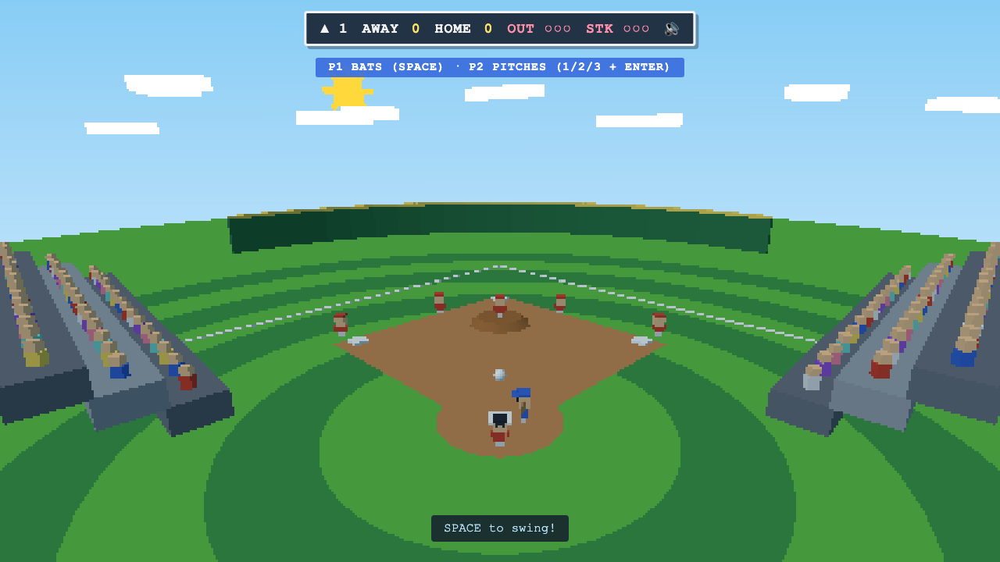

# ⚾ Tiny Baseball

A tiny, cozy, retro arcade baseball game in the browser — chunky low-res
three.js, chibi players, a crowd that cheers and does the wave, and a warm
blue sky. Simple mechanics: pitch, time your swing, everything else is
automatic.



## Run it

```
npm install
npm run dev        # dev server
npm run validate   # typecheck + unit + build + e2e, ends with VALIDATION: ALL PASSED
```

## How to play

3 innings, 3 outs, no balls or walks — every pitch is hittable. Swing timing
decides everything: dead-on can leave the park; late or early is a foul or a
whiff. 3 strikes is an out (fouls never make the third). Runners advance and
score automatically.

### 2P — shared keyboard

One player bats, the other pitches; sides swap automatically every
half-inning (the blue banner tells you who does what).

| Role | Keys |
|---|---|
| Batter | `Space` — swing |
| Pitcher | `1` fastball · `2` curve · `3` changeup, `←`/`→` aim, `Enter` throw |

### 1P — vs CPU

You bat your half (`Space`) and pitch the CPU's half (`1/2/3`, `←`/`→`,
`Enter`). The CPU handles the rest.

### Everywhere

- `1` / `2` on the title screen picks the mode (or click).
- `M` mutes/unmutes (remembered across visits).
- `Enter` on the game-over screen starts a rematch.
- `?seed=123` in the URL fixes the game's RNG seed.

## Constraints (by design)

No remote assets at all: geometry is procedural, audio is WebAudio-synthesized
at runtime, fonts are system fonts. The whole build is < 0.5 MB.
