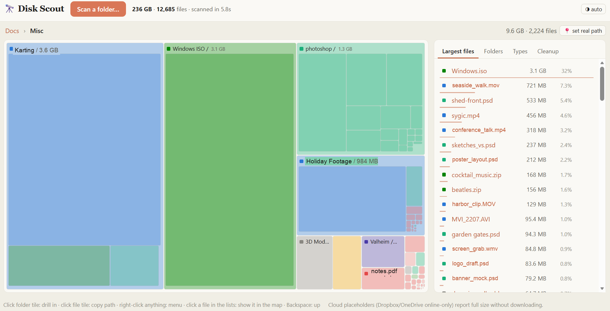

# 🔭 Disk Scout

**Where is your storage going?** Disk Scout is a single-file, browser-based disk-space
visualizer. Point it at a folder and it maps every byte inside: an interactive treemap to
dig around, the biggest files at a glance, a breakdown by file type, and cleanup hints — so
you can decide what to delete.

Everything runs **locally in your browser**. Nothing is uploaded, no network is used, and
Disk Scout never deletes anything — it only measures.



## What it does

- **Interactive treemap** — every file and folder is a tile sized by how much space it uses,
  coloured by category. Click a folder tile to drill in; use the breadcrumb bar or `Backspace`
  to climb back out. Large folders show a faint preview of what's inside them.
- **Largest files** — the top files across the current subtree, ranked, so the space hogs
  surface immediately.
- **Folders** — direct sub-folders (and loose files) ranked by size, with a bar for quick
  comparison.
- **Types** — a stacked bar and legend breaking the current view down by category: video,
  photos & images, audio, archives & disk images, apps & code, documents, and other.
- **Cleanup** — flags two kinds of easy wins:
  - **Junk-named folders** — caches, `node_modules`, recycle bins, temp folders, and friends.
  - **Large & untouched files** — anything ≥ 100 MB that hasn't been modified in 2+ years.

## How it works

- Uses the **File System Access API** (Chrome & Edge) for a native folder picker, and falls
  back to the standard directory `<input>` on **Firefox & Safari**. The fallback shows a
  generic browser "upload" warning — nothing is actually uploaded.
- **Copy a path** by clicking a file tile, or use the right-click menu on any tile or list row.
  Click **📍 set real path** in the breadcrumb bar to tell Disk Scout the scanned folder's full
  location so copied paths come out absolute and paste straight into Explorer / Finder.
- **Cloud placeholders** (Dropbox / OneDrive online-only files) report their full size without
  being downloaded.
- **Theme** follows your system (auto), with a toggle for forced light or dark — a warm,
  Claude-style palette either way.

Disk Scout never deletes: copy a path and handle it yourself in Explorer / Finder, or hand the
candidates to an assistant to review with you.

## Running it

It's a single self-contained `index.html` — no build step, no dependencies.

- Open `index.html` directly in Chrome or Edge, **or**
- Serve the folder and visit it in a browser:

  ```sh
  python3 -m http.server
  # then open http://localhost:8000/disk-scout/
  ```

> Opening straight from `file://` works too; if the native picker is blocked there, Disk Scout
> automatically uses the fallback picker.
