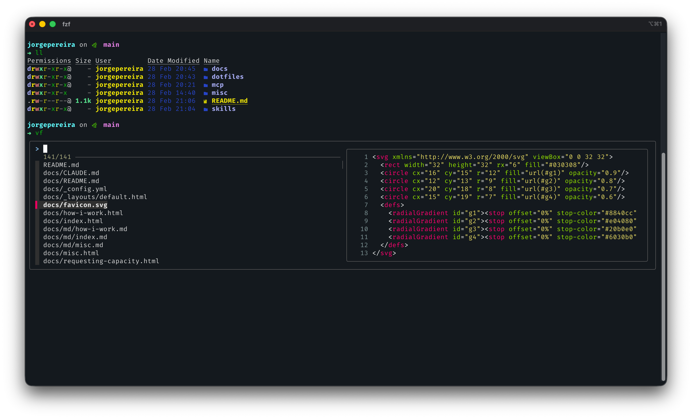

# Dotfiles

My macOS shell, git, and editor configuration files.

## iTerm2 + Zsh



My terminal runs on [iTerm2](https://iterm2.com/) with Zsh, [Starship](https://starship.rs/) prompt, vim keybindings, and a handful of modern CLI replacements like [eza](https://github.com/eza-community/eza), [bat](https://github.com/sharkdp/bat), [fd](https://github.com/sharkdp/fd), and [fzf](https://github.com/junegunn/fzf).

## What's included

| File | Source | Description |
|---|---|---|
| `zshrc` | `~/.zshrc` | Zsh configuration — prompt, aliases, plugins, keybindings |
| `zprofile` | `~/.zprofile` | Zsh login profile — PATH setup for Homebrew, Python, Agency |
| `gitignore_global` | `~/.config/git/ignore` | Global gitignore patterns |
| `nvim/init.lua` | `~/.config/nvim/init.lua` | Neovim entry point — bootstraps lazy.nvim plugin manager |
| `nvim/lua/config/lazy.lua` | `~/.config/nvim/lua/config/lazy.lua` | Neovim plugin manager config |

## Zsh setup

My shell runs on **Zsh** with the following stack:

- **Prompt:** [Starship](https://starship.rs/) — fast, cross-shell prompt with minimal config
- **Keybindings:** Vim mode (`bindkey -v`)
- **Editor:** Neovim (`$EDITOR=nvim`)

### Modern CLI replacements

| Standard tool | Replacement | Alias |
|---|---|---|
| `ls` | [eza](https://github.com/eza-community/eza) | `ls`, `ll`, `la` |
| `cat` | [bat](https://github.com/sharkdp/bat) | `cat` |
| `find` | [fd](https://github.com/sharkdp/fd) | `findf` |
| `grep` (fuzzy) | [fzf](https://github.com/junegunn/fzf) | `f` |

### Fuzzy shortcuts

- `vf` — fuzzy-find a file and open it in Neovim
- `cf` — fuzzy-find a directory and cd into it
- `Ctrl+T` — fzf file picker (with bat preview)
- `Alt+C` — fzf directory picker

### Plugins (Oh My Zsh)

- [zsh-autosuggestions](https://github.com/zsh-users/zsh-autosuggestions) — inline suggestions from history
- [zsh-syntax-highlighting](https://github.com/zsh-users/zsh-syntax-highlighting) — real-time command highlighting
- [zsh-history-substring-search](https://github.com/zsh-users/zsh-history-substring-search) — search history with arrow keys

### Shell options

- Case-insensitive globbing (`NO_CASE_GLOB`)
- Typo correction (`CORRECT`)
- Shared, incremental history across sessions (10,000 entries)

### Cool things you can do with this setup

**Fuzzy-open any file in your project in Neovim:**
```sh
vf
# Type a few characters of the filename, pick it from the list, opens in nvim
```

**Fuzzy-cd into any nested directory:**
```sh
cf
# Type part of a folder name, select it, and you're there
```

**Preview files without opening them:**
```sh
cat README.md
# bat shows syntax-highlighted output with line numbers
```

**Search for a file by name (blazingly fast):**
```sh
findf server          # finds all files with "server" in the name
findf -e ts           # finds all .ts files
findf -e md -d 2      # finds all .md files, max 2 directories deep
```

**Browse a directory with icons and git status:**
```sh
ls                    # eza with icons
ll                    # long list with file sizes
la                    # long list including hidden files
```

**Find and open a file matching a pattern:**
```sh
nvim $(fd -e ts | fzf)
# Narrows to .ts files, fuzzy pick one, opens in Neovim
```

**Re-run a command from history (substring search):**
```sh
# Start typing a partial command, then press ↑/↓ to cycle through
# all past commands that contain that substring
git push    # press ↑ to cycle through all past "git push" commands
```

**Get autosuggestions as you type:**
```sh
# Start typing any command — a gray suggestion appears from your history
# Press → (right arrow) to accept the full suggestion
docker com  # suggests: docker compose up
```

**Fix a typo automatically:**
```sh
gti status
# Zsh asks: "zsh: correct 'gti' to 'git' [nyae]?" — press y
```

**Pipe anything into bat for syntax highlighting:**
```sh
curl -s https://api.github.com/users/octocat | bat -l json
# API response with colored, formatted JSON
```

**Use vim keybindings in the shell:**
```sh
# Press Escape to enter normal mode, then:
#   0     — jump to start of line
#   $     — jump to end of line
#   b/w   — move back/forward by word
#   dd    — clear the line
#   /     — search command history
# Press i or a to go back to insert mode
```

## Setting up a fresh Mac from scratch

This is a step-by-step guide to reproduce my full terminal setup on a brand new Mac.

### Step 1: Install Homebrew

Homebrew is the foundation — almost everything else installs through it.

```sh
/bin/bash -c "$(curl -fsSL https://raw.githubusercontent.com/Homebrew/install/HEAD/install.sh)"
eval "$(/opt/homebrew/bin/brew shellenv)"
```

### Step 2: Install iTerm2

[iTerm2](https://iterm2.com/) replaces the default Terminal.app. It has better split panes, search, profiles, and color scheme support.

```sh
brew install --cask iterm2
```

Open iTerm2 and use it for the rest of the steps.

### Step 3: Install core CLI tools

These replace the outdated macOS defaults with faster, more colorful alternatives.

```sh
brew install git neovim starship eza bat fd fzf
```

| Tool | What it does |
|---|---|
| `git` | Latest Git (macOS ships an old version) |
| `neovim` | Modern Vim fork — my default editor |
| `starship` | Fast, minimal cross-shell prompt |
| `eza` | Modern `ls` replacement with icons and colors |
| `bat` | `cat` with syntax highlighting and line numbers |
| `fd` | Fast `find` alternative |
| `fzf` | Fuzzy finder for files, directories, and history |

Run fzf's install script to set up keybindings (Ctrl+T, Alt+C):

```sh
$(brew --prefix)/opt/fzf/install
```

### Step 4: Install Oh My Zsh and plugins

macOS already ships with Zsh, but [Oh My Zsh](https://ohmyz.sh/) adds a plugin framework on top of it.

```sh
sh -c "$(curl -fsSL https://raw.githubusercontent.com/ohmyzsh/ohmyzsh/master/tools/install.sh)"
```

Then install the three plugins my config uses:

```sh
git clone https://github.com/zsh-users/zsh-autosuggestions ${ZSH_CUSTOM:-~/.oh-my-zsh/custom}/plugins/zsh-autosuggestions
git clone https://github.com/zsh-users/zsh-syntax-highlighting ${ZSH_CUSTOM:-~/.oh-my-zsh/custom}/plugins/zsh-syntax-highlighting
git clone https://github.com/zsh-users/zsh-history-substring-search ${ZSH_CUSTOM:-~/.oh-my-zsh/custom}/plugins/zsh-history-substring-search
```

### Step 5: Install additional runtimes

```sh
# Node.js (required for MCP servers)
brew install node

# Python
brew install python

# Ruby (via rbenv)
brew install rbenv
rbenv init
rbenv install 3.3.0  # or whatever version you need
rbenv global 3.3.0

# Azure CLI (required for Service Tree and Substrate MCP servers)
brew install azure-cli

# Docker Desktop (optional)
brew install --cask docker
```

### Step 6: Clone this repo and symlink dotfiles

```sh
git clone https://github.com/m365-core/jorgepereira.git
cd jorgepereira/dotfiles

# Zsh
ln -sf $(pwd)/zshrc ~/.zshrc
ln -sf $(pwd)/zprofile ~/.zprofile

# Git
mkdir -p ~/.config/git
ln -sf $(pwd)/gitignore_global ~/.config/git/ignore

# Neovim
mkdir -p ~/.config/nvim/lua/config
ln -sf $(pwd)/nvim/init.lua ~/.config/nvim/init.lua
ln -sf $(pwd)/nvim/lua/config/lazy.lua ~/.config/nvim/lua/config/lazy.lua
```

Make sure to update `gitconfig` with your own name and email before using it.

### Step 7: Reload and verify

Open a new iTerm2 tab (or restart iTerm2) to pick up the new config:

```sh
source ~/.zshrc
```

You should see the Starship prompt, and these should all work:

```sh
ls          # eza with icons
cat --help  # bat
fd .        # fd file finder
fzf         # fuzzy finder
nvim        # Neovim with lazy.nvim
```

Neovim will auto-bootstrap lazy.nvim on first launch — just let it finish installing.

## Neovim

My Neovim setup is minimal:

- **Plugin manager:** [lazy.nvim](https://github.com/folke/lazy.nvim) — auto-bootstraps on first launch
- **Leader key:** Space
- **Colorscheme:** habamax (default)

The `init.lua` bootstraps lazy.nvim and delegates plugin loading to `lua/config/lazy.lua`. To add plugins, add entries to the `spec` table in `lazy.lua`.
