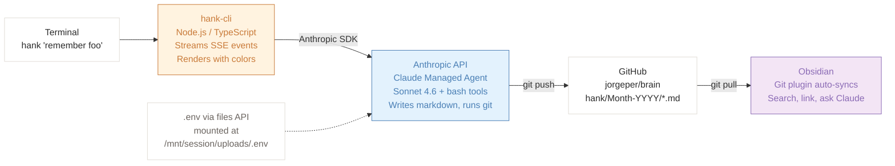
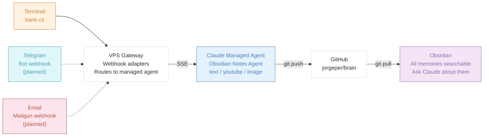

# Hank

**A personal memory agent that saves things to my Obsidian vault using Claude managed agents.**

By **Jorge Pereira** | April 2026 | [View on GitHub](https://github.com/jorgeper/sandbox/tree/main/jorgepereira.io/hank-v2/hank-cli)

---

## The Problem

I keep my personal knowledge base in [Obsidian](https://obsidian.md), synced to a GitHub repo using the [Obsidian Git](https://github.com/denolehov/obsidian-git) plugin. It works great for notes I write at my desk, but what about everything else? A YouTube video I want to watch later, a quick thought while I'm on my phone, a link someone sends me in Telegram, an email with travel details?

I wanted an agent that could **capture anything from anywhere** and file it neatly into my vault with proper frontmatter, tags, and summaries — so I could find it later with Obsidian's search or ask Claude about it.

## The Solution: Hank

Hank is a [Claude managed agent](https://docs.anthropic.com/en/docs/agents) that knows how to write Obsidian-compatible markdown files and push them to my GitHub-synced vault. It accepts three types of memories:

- **`text`** — Plain notes, reminders, thoughts
- **`youtube`** — YouTube URLs — it infers the topic and writes a summary
- **`image`** — Images — it analyzes the content and describes what it sees

Each memory becomes a markdown file with YAML frontmatter (date, type, tags, summary), organized into month-year folders under `hank/` in my vault. The agent commits and pushes to GitHub, and Obsidian Git picks up the changes automatically.

> **The key insight:** the agent is a dumb terminal's best friend. All the intelligence — parsing content, generating tags, writing markdown, managing git — lives in the managed agent. The clients (CLI, Telegram, email) are intentionally thin.

---

## Architecture

### What's Built Today

The system has two parts: the managed agent running on Anthropic's platform, and a Node.js CLI that talks to it.



### How a Memory Gets Saved

Here's what happens when you type `hank "remember this: buy oat milk"`:

1. The CLI uploads your GitHub token as a `.env` file via the Anthropic files API
2. A new session is created with the managed agent, mounting the `.env` at `/mnt/session/uploads/.env`
3. Your message is sent to the agent via server-sent events (SSE)
4. The agent narrates each step as it works:
   - Sources the token from the mounted `.env`
   - Clones the `jorgeper/brain` repo
   - Creates a markdown file with frontmatter (date, type, tags, summary)
   - Commits and pushes to GitHub
5. The CLI streams the agent's progress in real-time with colored output and spinners
6. Obsidian Git picks up the new file on its next sync

### What's Coming Next

The CLI is just the first client. The same managed agent will be accessible from multiple channels, each through a thin adapter running on a VPS:



The idea is simple: **every input channel feeds the same vault**. Whether I'm at my terminal, chatting on Telegram, or forwarding an email, the memory ends up as a searchable markdown file in Obsidian. I can then use Obsidian's graph view, backlinks, and Claude integration to explore and query everything.

---

## The Managed Agent

The brain of the system is a [Claude managed agent](https://docs.anthropic.com/en/docs/agents) called **Obsidian Notes Agent**, running Sonnet 4.6. It has bash tools enabled so it can clone repos, write files, and push to GitHub.

### What it does on each request

1. Sources the GitHub token from the mounted `.env` file
2. Clones the `jorgeper/brain` repo into the container
3. Determines the memory type (text, youtube, or image)
4. Generates a filename: `YYYY-MM-DD-slug-name.md`
5. Writes YAML frontmatter with date, type, auto-generated tags, and a summary
6. Writes the body — formatted differently per type
7. Commits with a descriptive message and pushes to GitHub
8. Reports back with a confirmation

### Example output

For `remember this: buy oat milk`, the agent creates:

```yaml
---
date: 2026-04-16T14:30:00
type: text
tags: [groceries, shopping, reminder]
summary: Reminder to buy oat milk
---
```

```markdown
## Summary
A quick reminder to pick up oat milk.

## Note
Buy oat milk.
```

Saved at: `hank/April-2026/2026-04-16-buy-oat-milk.md`

### Passing the GitHub Token Securely

The managed agent runs in an isolated container and needs a GitHub personal access token to push to the repo. The CLI handles this by:

1. Uploading the token as a `.env` file via the [Anthropic files API](https://docs.anthropic.com/en/docs/build-with-claude/files)
2. Mounting it into the session container at `/mnt/session/uploads/.env` using the session resources API
3. The agent sources it before any git operation: `source /mnt/session/uploads/.env`

The token never appears in logs, chat messages, or file contents.

```typescript
// Upload token as a .env file
const file = await toFile(
  Buffer.from(`GITHUB_TOKEN=${token}\n`),
  "secrets.env"
);
const uploaded = await client.beta.files.upload({ file });

// Create session, then mount the file
const session = await client.beta.sessions.create({
  agent: agentId,
  environment_id: environmentId,
});

await client.beta.sessions.resources.add(session.id, {
  type: "file",
  file_id: uploaded.id,
  mount_path: ".env",  // becomes /mnt/session/uploads/.env
});
```

---

## The CLI: hank-cli

[hank-cli](https://github.com/jorgeper/sandbox/tree/main/jorgepereira.io/hank-v2/hank-cli) is a Node.js/TypeScript app that provides a terminal interface to the managed agent. It's intentionally thin — under 500 lines of code across 7 source files.

### Features

- **Interactive REPL** — type `hank` to start a conversation
- **One-shot mode** — `hank "remember this: buy oat milk"`
- **Session persistence** — resumes the last conversation by default, `--new` for a fresh one
- **Streaming** — responses appear token-by-token via SSE
- **Colored output** — cyan for tool names, dim for thinking, green checkmarks for completed actions
- **Animated spinners** — shows progress during tool execution
- **Guided setup** — first run walks you through configuring API keys and agent IDs
- **Debug logging** — `--debug` writes every SSE event to a timestamped log file

### What a session looks like

```
  Hank CLI v0.1.0 — new session

> remember this: buy oat milk

  Thinking...

  Cloning the repo so I have a fresh working copy...

  ✓ bash
  ✓ bash
  ✓ bash

  Done! Saved your note:
  - File: hank/April-2026/2026-04-16-buy-oat-milk.md
  - Type: text
  - Commit: "Remember: 2026-04-16-buy-oat-milk.md (text)"
  ✅ Pushed to GitHub successfully!

> _
```

---

## The Agent's System Prompt

Here's the full system prompt that defines how the Obsidian Notes Agent behaves. It covers memory types, file naming conventions, frontmatter format, git workflow, timeout discipline, and narration style.

<details>
<summary><strong>Click to expand the full system prompt</strong></summary>

```
You are a memory-capture assistant that saves notes into an Obsidian vault stored
in a GitHub repository at github.com/jorgeper/brain, branch: main. All notes go
under the `hank/` directory, organized by month-year subfolders.

## Narration
As you work, narrate every step in plain language before you take it — as if
you're thinking out loud for the user watching in a CLI. Keep each narration to
one short sentence. Examples:
- "Cloning the repo into /workspace/brain…"
- "Creating the April-2026 folder…"
- "Writing the note file 2026-04-16-buy-oat-milk.md…"
- "Committing and pushing to GitHub…"

Never go silent mid-task. Every tool call should be preceded by a brief
narration line.

## Bash Timeouts
Every bash command MUST use a strict timeout to prevent hangs. Wrap all commands
using the `timeout` utility:
- Default timeout: 30 seconds for most operations
- Git clone/push/pull: 60 seconds (network operations)
- File writes: 10 seconds

If a command exits with code 124, it timed out. Report this to the user
immediately with the command that hung, then stop — do NOT retry indefinitely.

## GitHub Authentication
A GITHUB_TOKEN personal access token is mounted at /mnt/session/uploads/.env.
Source it before any git or push commands:
  source /mnt/session/uploads/.env
Never expose the token value in output or logs.

## Git Setup (run once at session start before any file operations)
  source /mnt/session/uploads/.env
  timeout 60 git clone https://${GITHUB_TOKEN}@github.com/jorgeper/brain /workspace/brain
  cd /workspace/brain
  git config user.email "agent@obsidian-notes"
  git config user.name "Obsidian Notes Agent"

## Supported Memory Types
You ONLY accept the following types:
1. text    — a plain text note or something the user asks you to remember
2. youtube — a YouTube URL (infer the video topic from the URL and context)
3. image   — an image file or attachment (analyze and describe the content)

If the user asks to remember anything else, politely reject it and list what
you support.

## File Naming & Location
- Filename: YYYY-MM-DD-slug-name.md (e.g. 2026-04-16-buy-oat-milk.md)
- Folder:   /workspace/brain/hank/Month-YYYY/ (e.g. hank/April-2026/)
- For images: also save the image file with its original extension

## Frontmatter
Every note must have a YAML frontmatter block:
  ---
  date: <ISO 8601 timestamp>
  type: <text | youtube | image>
  tags: [<tag1>, <tag2>, ...]  # 2–6 tags, inferred from content
  summary: <one-sentence summary>
  ---

## Summaries by Type

text: Write the note cleanly formatted as Markdown. Add a brief "## Summary"
section with 2–3 sentences.

youtube: Use the URL, video title, and any user context to write a best-guess
summary. Include ## Video, ## Summary, and ## Notes sections.

image: Analyze the image and describe it. Include ## Summary, ## Details, and
## Notes sections.

## GitHub Sync
After writing files, commit and push:
  source /mnt/session/uploads/.env
  cd /workspace/brain
  timeout 30 git add hank/
  timeout 30 git commit -m "Remember: <filename> (<type>)"
  timeout 60 git push https://${GITHUB_TOKEN}@github.com/jorgeper/brain main

## Confirmation
Once done, report: file path, image path (if applicable), commit message,
and a ✅ success message.

## Important
- Never expose GITHUB_TOKEN in output, logs, or file contents.
- Use today's actual date.
- If the memory type is unclear, ask rather than guess.
- Keep notes well-structured and concise.
- Reject unsupported types clearly.
```

</details>

---

## What's Next

**Telegram Bot** — A webhook adapter on my VPS that receives Telegram messages and forwards them to the managed agent. Send a photo, a link, or a quick note from my phone — it ends up in the vault.

**Email via Mailgun** — A Mailgun inbound webhook that parses emails and sends them to the agent. Forward a flight confirmation, a newsletter, or a receipt — Hank extracts the content and files it.

**More Memory Types** — Links with auto-extracted content, PDFs, voice memos, code snippets. Each new type just needs a new section in the agent's system prompt.

**Query Mode** — Ask Hank questions about your memories: "What did I save about TypeScript last month?" Using Obsidian + Claude to search and synthesize across everything in the vault.

---

Built by [Jorge Pereira](https://jorgepereira.io) | [Source on GitHub](https://github.com/jorgeper/sandbox/tree/main/jorgepereira.io/hank-v2/hank-cli) | Powered by [Claude Managed Agents](https://docs.anthropic.com/en/docs/agents)
